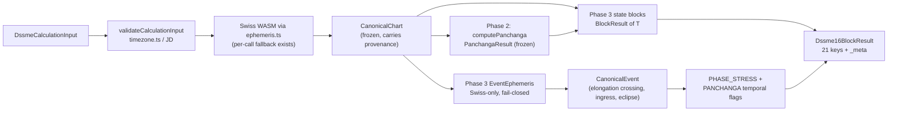
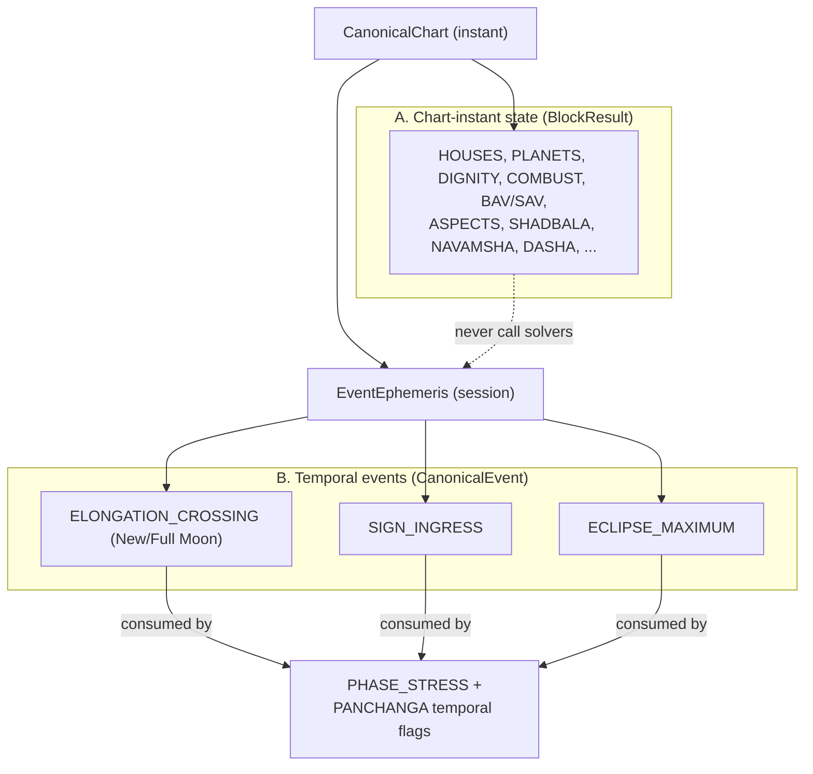
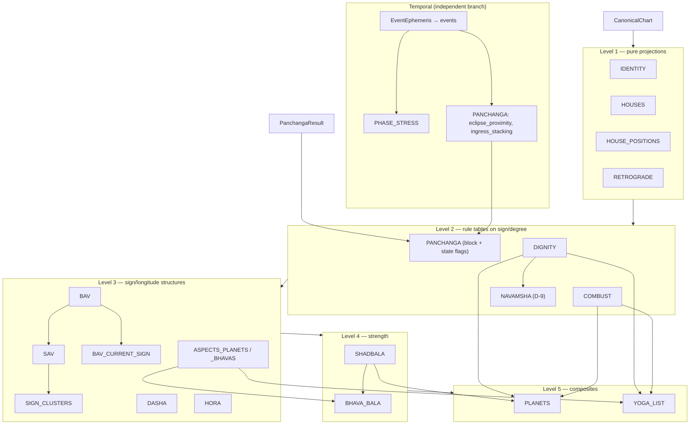
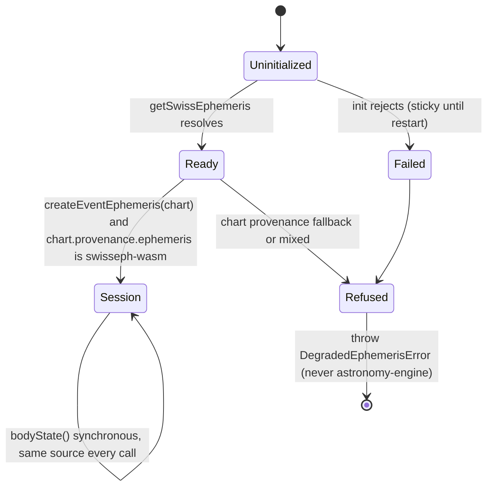
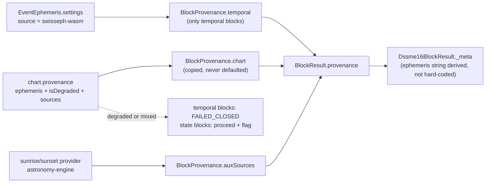
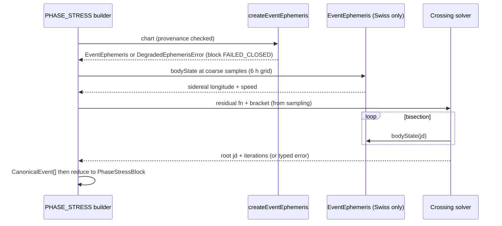
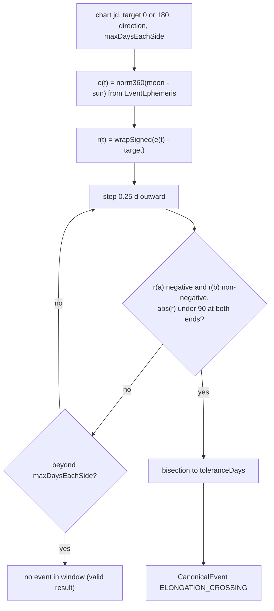
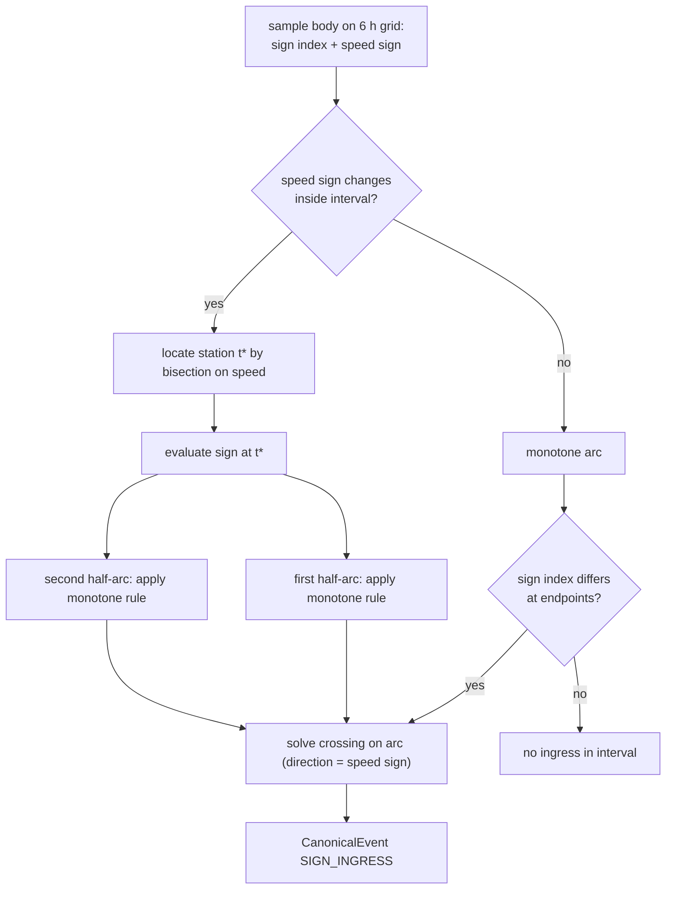
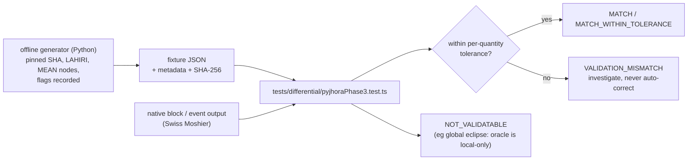
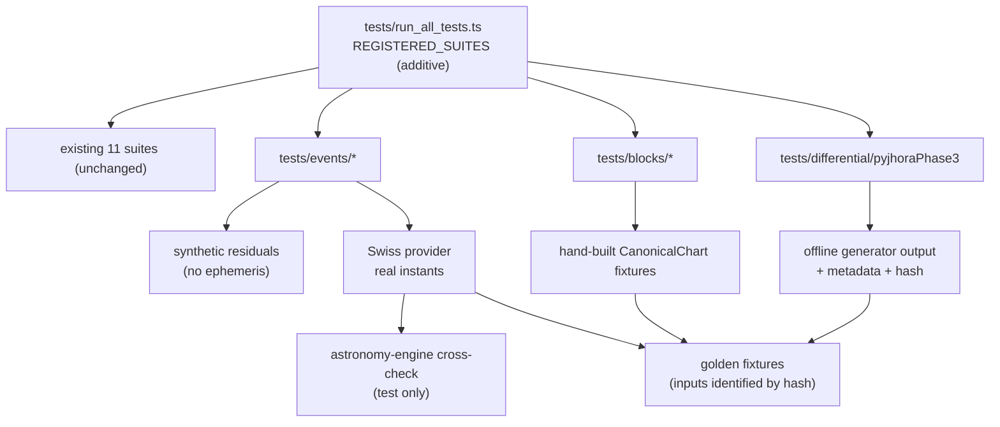

# DSSME EVENT CALCULATION ENGINE V1.0 — PHASE 3 ARCHITECTURE & DESIGN

| | |
|---|---|
| **Status** | DESIGN ONLY — no source file, test, dependency, or API route was changed |
| **Date** | 2026-09-30 |
| **Baseline** | Phase 1 + Phase 2 as frozen (`reports/PHASE_2_PANCHANGA_FREEZE.md`, 2026-09-29) |
| **Primary objective** | **A — complete the remaining DSSME state blocks first.** No generalized Event Search API. |
| **Deliverable** | This file. A separate Phase 3 BUILD prompt can consume it without re-discovering the repository. |

### Evidence labels (used on every architectural claim)

| Label | Meaning |
|---|---|
| `[REPO]` | VERIFIED FROM REPOSITORY — read in the supplied source/tests/reports |
| `[SPEC]` | VERIFIED FROM SPECIFICATION — read in the supplied DSSME spec documents |
| `[PYJHORA]` | VERIFIED FROM PYJHORA — read in the pinned upstream source (SHA below) |
| `[MEASURED]` | Measured in this session in an isolated Node sandbox against the repo's pinned packages (`@swisseph/browser` 1.4.0 → Swiss Ephemeris 2.10.03 Moshier; `astronomy-engine` 2.1.19). Not the repo's own test run, not the user's machine. |
| `[INFERENCE]` | Reasoned from the above; not read or measured directly |
| `[DECISION REQUIRED]` | Unresolved semantics — **DO NOT IMPLEMENT** until a Decision Gate (§16) closes |
| `[FUTURE]` | Not required by the current spec; excluded from Phase 3 |

Where something does not exist in the supplied files, this document says `NOT IMPLEMENTED IN CURRENT REPOSITORY`.

---

## 1. Executive Summary

**What Phase 3 is.** Two things, kept strictly separate:

1. a **`BlockResult` layer** — pure, deterministic builders that turn `CanonicalChart` (+ `PanchangaResult`) into the 21 output keys of `Dssme16BlockResult`; and
2. a **deliberately small `CanonicalEvent` layer** — a source-consistent ephemeris session and one crossing solver, used by exactly three consumers: `PHASE_STRESS`, `PANCHANGA.eclipse_proximity`, `PANCHANGA.ingress_stacking`.

**Current state** `[REPO]`: of 21 output keys, **1 has complete data** (`HOUSES`), **5 are partial** (`IDENTITY`, `PANCHANGA`, `PLANETS`, `RETROGRADE`, `HOUSE_POSITIONS`), and **15 exist only as type contracts** in `dssme-canonical-types.ts`. **No block builder exists** for any of them.

**Headline design decisions**

| # | Decision |
|---|---|
| D1 | `BlockResult ≠ CanonicalEvent`. Only 3 consumers need events. The other 18 blocks are chart-instant state and never touch a temporal solver. |
| D2 | The event layer gets **its own ephemeris session** (`EventEphemeris`) created once, Swiss-only, **fail-closed**. `calculateBodyPosition`'s per-call Swiss→astronomy-engine fallback is never used for root finding. |
| D3 | Event solvers work in **sidereal longitude only** (ayanamsa applied by Swiss at the evaluated JD). No tropical longitude is exposed → no stale-ayanamsa path. |
| D4 | **Mean nodes preserved.** Rahu/Ketu are monotonic decreasing (`-0.052992°/day`, 1095/1095 daily samples negative `[MEASURED]`) → no station detection for nodes; they still *ingress* (decreasing crossing). |
| D5 | New/Full Moon = **elongation crossing** of `0°/180°`, solved with a bracketed bisection. No extrema solver. |
| D6 | Only **one solver family** is required: a direction-aware *crossing* solver + an *ingress window scan* that handles a station inside the window by monotone-arc partition. Standalone station reporting, threshold, extrema, cycle solvers are `[FUTURE]`/excluded. |
| D7 | **20 Decision Gates** (§16) must close before the affected code is written. Several change outputs on the project's own reference chart (§15.4). |

**Findings that change the plan (all detailed in §2.3)**

* The **reference JSON** (`DSSME_CHART_2026-09-16_Chofu.json`) matches the engine on Lagna (Δ0.005°), Moon (Δ0.022°) and Rahu (Δ0.0003°) but **disagrees on Sun, Mars, Mercury, Jupiter, Venus, Saturn by 0.26°–0.50°** at the same instant. Cause unknown. It flips the Block-14 outputs (§15.4). It cannot be used as a numeric golden until Gate T-10 closes.
* The **pinned PyJHora SHA in the Phase 3 prompt (§23) is 43 hex characters and returns HTTP 404**; the 40-character SHA in the repo docs resolves. This document uses the 40-character one.
* PyJHora's eclipse API at the pin is **local-only**; its **defaults are True Node and `TRUE_PUSHYA` ayanamsa** — a differential run must override both.
* Two frozen-code observations to report, **not fix** in Phase 3: `/api/panchanga`'s error filter can never match (§2.3 C-06); Phase 2's provider file breaks the "only `ephemeris.ts` imports ephemeris packages" invariant (C-03).

### Diagram 1 — Overall Phase 1 → Phase 2 → Phase 3 architecture



---

## 2. Repository Inspection Results

### 2.1 What was and was not inspected — read this first

The complete repository tree was **not available** to me. I inspected the **uploaded document set**: all `src/` files supplied (types, `astronomy/*`, `canonical/*`, `panchanga/*`, `components/*`, `utils/timezoneHelper.ts`, `App.tsx`, `main.tsx`), `server.ts`, all 11 registered test files plus `run_all_tests.ts`, `package.json`, `package-lock.json`, `tsconfig.json`, `vite.config.ts`, `metadata.json`, `.env.example`, `.gitignore`, `index.html`, all `reports/*`, the Phase 1 handoff, the extraction prompt v1.4, three v1.5 spec variants, and the Chofu reference JSON.

**Not inspected / not available:** `CLAUDE.md`, `bun.lock`, git history, any file not supplied, the repo's own `tsc` / test / build results (I did not run the repository — only isolated probes against the same pinned npm packages). Any statement "not present" below means **not present in the supplied files**; a full-tree `git grep` still has to be run by the BUILD session.

### 2.2 Term search (prompt §1) — results

| Term | Where found (supplied files) | Status |
|---|---|---|
| `Dssme16BlockResult` | `dssme-canonical-types.ts` (type only) | Type only — no producer |
| `DASHA` / `DashaBlock` | types only | NOT IMPLEMENTED IN CURRENT REPOSITORY (no calculation) |
| `SHADBALA`, `BHAVA_BALA`, `BAV`, `SAV`, `ASPECTS_*`, `DIGNITY`, `COMBUST`, `NAVAMSHA`, `YOGA_LIST`, `HORA`, `SIGN_CLUSTERS` | types only; sample values in the reference JSON | NOT IMPLEMENTED IN CURRENT REPOSITORY |
| `PHASE_STRESS` / `PhaseStressBlock` | types only (`ingress_within_24h: NineBody[]`, `sign_boundary_planets: NineBody[]`) | NOT IMPLEMENTED IN CURRENT REPOSITORY |
| `eclipseProximity`, `ingressStacking` | camelCase only in the v1.5 compact spec's `DssmeExecutionInput`; snake_case in `PanchangaBlock` | NOT IMPLEMENTED IN CURRENT REPOSITORY |
| `retrograde` | `CanonicalBodyPosition.isRetrograde` (speed < 0), validation rules | State flag only |
| `station`, `ingress`, `phase`, `eclipse` (solvers) | none in `src/` | NOT IMPLEMENTED IN CURRENT REPOSITORY |
| `CanonicalChart`, `CanonicalBodyPosition`, `provenance` | types + `canonicalChart.ts` + `canonicalValidation.ts` | EXISTS (frozen) |
| `DegradedEphemerisError` | `panchangaProviders.ts` | EXISTS (Phase 2) |
| `calculateBodyPosition` | `ephemeris.ts` — per-call `try/catch` → `calculateBodyWithAstronomyEngine` | EXISTS (frozen); **unsuitable for solvers** (§9) |
| `norm360`, `wrapSigned`, `segmentIndex` | `panchanga/angles.ts` | EXISTS (frozen); reuse |
| `normalize360` | `astronomy/ephemeris.ts` — same semantics, third copy | EXISTS |
| `panchangaBoundaries` (`findBoundary`) | `panchanga/panchangaBoundaries.ts`; header: "Assumes the angle only increases" | EXISTS; **monotonic only** |

### 2.3 Source conflicts and observed defects (do not silently reconcile)

| ID | Conflict / observation | Governs | Action |
|---|---|---|---|
| C-01 | Phase 3 prompt §23 pins PyJHora to `48e57d29b47a3143519919910a24866758116467485` (**43 hex chars**, invalid). Repo docs use `48e57d29b47a3143519910a24866758116467485` (40). `raw.githubusercontent.com/.../<43-char>/...` → **404**; 40-char → **200** `[MEASURED]`. | 40-char SHA | Correct the prompt; this document uses the 40-char SHA. |
| C-02 | Phase 1 gate/handoff/decisions say "`CanonicalChart` carries no per-request provenance" (`LOGGED_ONLY`). Current source **does**: `CanonicalChart.provenance`, `ChartProvenance`, validation that rejects a missing one, `server.ts` returns `chart.provenance`. | **Current source** | The frozen baseline is *source at Phase 2 freeze*, which already amends the Phase 1 handoff. Reports are stale on this point. |
| C-03 | Handoff §6/§13: "Only `ephemeris.ts` imports [ephemeris packages]". `panchangaProviders.ts` imports both `@swisseph/browser` and `astronomy-engine`. | Source | Gate A-01. |
| C-04 | Handoff says package manager is **bun** (`bun.lock`); `package.json` declares `"packageManager": "npm@10.8.2"` and `package-lock.json` is supplied (`bun.lock` was not). Reports cite `@swisseph/browser` **1.3.1**; `package.json` pins **1.4.0** (`@swisseph/core` 1.4.0 in the lock). | `package.json` + lock | BUILD session must verify the lockfile of record before any fixture is generated (Swiss version affects numbers). | **RESOLVED at `main` 5b79ece:** `bun.lock` was removed in `3d76d10`; `package-lock.json` is the lockfile of record; installed `@swisseph/browser` is 1.4.0 `[MEASURED via npm ci]`.
| C-05 | Handoff §4: runner is "fail-fast". Actual `run_all_tests.ts` runs **all** suites, collects failures, then `process.exit(1)`. | Source | Register suites accordingly. |
| C-06 | `server.ts` `/api/panchanga` filters `validationIssues` with `i.severity === "error"`, but `ValidationIssue` in `panchangaValidation.ts` is `{ gate, message }` — **no `severity`**. `hasErrorIssues` can never be true, so validation failures return HTTP 200. Found by code inspection; not executed. | Source (defect) | Report only. Phase 3 `BlockIssue` includes `severity` (the field this endpoint already assumes). Fix needs explicit approval (frozen). |
| C-07 | A fixture nickname was used for three different charts (three different dates in the differential test, the Panchanga test/freeze report, and an `App.tsx` preset). **RESOLVED at `main` 5b79ece** ("sanitize nomenclature"): nicknames removed from tests/App. Rule kept: every Phase 3 fixture is identified by input hash, never by name. | — | Hash-only identification. |
| C-08 | Differential "Chofu" fixture is `2026-09-16 14:30 JST` (Lagna Sagittarius); the Chofu reference JSON is `18:50 JST` (Lagna Pisces). Differential assertions are **sign-level only**, hard-coded, with no recorded generation metadata. They are static fixtures, **not** live PyJHora runs (the file's own header says so). | Source | §17. |
| C-09 | **Reference JSON vs engine at the same instant** (`2026-09-16 18:50 JST`, JD 2461299.909722222, Swiss/Moshier/Lahiri) — table below. | — | Gate T-10. |
| C-10 | Reference JSON `PHASE_STRESS` = `{127, 233, [], [], "LOW"}`. Extraction spec §2 Rule 9: proximity is "**0 if more than 72h away**" and `LOW` needs (new-moon 48–72 h ∨ full-moon 24–72 h ∨ ≥2 ingresses ∨ ≥3 boundary planets). Neither reference value satisfies either rule. | — | Gates T-02, T-03. |
| C-11 | Three files all called v1.5: `/mnt/project/…_v1_5.md` (front-matter 1.5, body/footer 1.4), `docs/DSSME_UNIVERSAL_MASTER_PROMPT_v1.5.md` (compact rewrite; Z-4 lacks the 48–72 h rows), `docs/DSSME_MASTER_CONTRACT_v1.5.md` (full clean rewrite; Z-4 retains them). | undeclared | Gate T-01. |
| C-12 | Literal conflicts: `engine_version` `"V3.0"` (extraction Rule 13) vs `"DSSME-Universal-1.4"` (reference JSON); `bodyMode` `"Full"` (input preset) vs `"9-body"` (spec/JSON); `upcoming_ad` dates `DD-MM-YYYY` (type/spec) vs ISO (JSON); latitude `"XX.XXN"` (spec) vs `"35.6528° N"` (JSON); names `Shashti`/`Vishkumbha` (PL) vs `Shashthi`/`Vishkambha` (engine). | — | Gate S-08. |
| C-13 | Sun Shadbala minimum 390 (contract) vs 300 (`const.py:1379`, `shad_bala_factors = [5,6,5,7,6.5,5.5,5]`) `[PYJHORA]`. Combustion lists in `const.py:635-636` are `[12,17,14,10,11,15]` (direct) and `[12,8,12,11,8,16]` (retrograde), commented "moon, mars, mercury, jupiter, venus, saturn"; read literally that gives Jupiter 10 / Venus 11, the **reverse** of DSSME's 11 / 10, and a retrograde set that differs from DSSME (Mercury 13, Venus 8, others unchanged). How `drik.py`/`charts.py` index the lists was **not inspected** — UNKNOWN. | — | Gates S-06, S-02. |
| C-14 | Stale labels: `App.tsx` header "Phase 1 Foundation" / "(7/7)"; `/api/health` `"phase": "PHASE_1_FOUNDATION"`; `server.ts` `isDegraded ?? false` (fail-open default, unreachable today because validation requires provenance). | — | Cosmetic; note only. |
| C-15 | `tsconfig.json` has no `"strict"`. TypeScript is `^7.0.2`. | Source | Phase 3 code must compile under `strict` locally without changing the frozen config (test via a per-file `tsc --strict` check). |

**C-09 detail `[MEASURED]`** — engine (Swiss/Moshier/Lahiri) minus reference JSON, same JD:

| Body | Engine ° | Ref JSON ° | Δ ° |
|---|---:|---:|---:|
| Lagna | 355.1458 | 355.1511 | −0.0053 |
| Moon | 212.2951 | 212.2731 | +0.0220 |
| Rahu (mean) | 304.2553 | 304.2550 | +0.0003 |
| Sun | 149.3275 | 148.9547 | **+0.3728** |
| Mars | 88.7524 | 88.3786 | **+0.3738** |
| Mercury | 165.1552 | 164.7858 | **+0.3693** |
| Jupiter | 112.6102 | 112.2686 | **+0.3416** |
| Venus | 189.3875 | 189.1236 | **+0.2639** |
| Saturn | 348.4514 | 347.9542 | **+0.4972** |

Lagna, Moon and Rahu agreeing rules out a wrong chart instant, location, or ayanamsa. A second engine agrees with Swiss on the Sun (astronomy-engine vs Swiss: 7.6″). The offsets are not a common time shift (implied shifts range −41 h…+166 h). **Cause: UNKNOWN.** All nine bodies stay in the same *sign*, so sign-level blocks (BAV/SAV, dignity, houses) are unaffected — the reference BAV rows total 48/49/39/54/56/52/39 and SAV totals 337, matching the classical totals and the recomputed column sums `[MEASURED]` (arithmetic check). **Degree-sensitive** blocks (combust, sign-boundary, ingress, aspects with orb, Bhava Bala) are affected.

---

## 3. Current Phase 1 / Phase 2 Frozen Contracts

`[REPO]` The frozen baseline is the source at the Phase 2 freeze. Phase 3 **consumes** it through these interfaces and modifies none of them.

| Contract | Location | Phase 3 use |
|---|---|---|
| `DssmeCalculationInput` (`timezoneOffset` caller-supplied, cross-checked against IANA) | types, `canonicalValidation.ts` | Input to everything |
| `CanonicalChart` `{input,time,location,ayanamsa,lagna,planets,houses,provenance}` | types, `canonicalChart.ts` | The only astronomical source for state blocks |
| `CanonicalBodyPosition` incl. mandatory `provenance`, `speedLongitude`, `isRetrograde` | types | Retrograde, degree, speed |
| Body set `NINE_BODIES_ORDER` = Sun, Moon, Mars, Mercury, Jupiter, Venus, Saturn, **Rahu, Ketu** | `planetaryPositions.ts` | Exact list; Lagna is a point, not a graha |
| Node model: Rahu = `LunarPoint.MeanNode`, Ketu = Rahu + 180° | `ephemeris.ts` | Preserved |
| `ChartProvenance {ephemeris, isDegraded, sources, runtime}` | types | Copied into `BlockProvenance` |
| `computePanchanga` → `PanchangaResult` (tithi/nakshatra/yoga/karana/vara + windows) | `panchanga/*` | Inputs to Block 2 mapping |
| `LongitudeProvider`, `createSwissLongitudeProvider`, `createCanonicalLongitudeProvider`, `DegradedEphemerisError` | `panchangaProviders.ts` | Pattern to mirror; error class to reuse |
| `norm360`, `wrapSigned`, `segmentIndex`, `jdToUtcIso` | `panchanga/angles.ts` | Reused — no duplicate (§20) |
| `findBoundary` (bracket-and-bisect, `θ̇ > 0` assumed, `maxDays = 3`) | `panchangaBoundaries.ts` | **Not** generalized (§12) |
| Test harness: manual `REGISTERED_SUITES` in `tests/run_all_tests.ts`, 11 suites, `tsx` | tests | Phase 3 suites register additively |

> **Architectural boundary (mandated).** The Phase 2 boundary solver is monotonic-only. It must not be extended to retrograde stations, speed extrema, or aspect extrema. Phase 3's crossing solver is a **new** module with a different precondition (§12), and Phase 2's file is untouched.

---

## 4. Current DSSME Block Inventory

Status vocabulary: **EXISTS** = data/calculation exists for the whole block · **PARTIAL** = some fields computable from existing code, no builder · **IDENTITY ONLY** = only the type contract in `dssme-canonical-types.ts` · **NOT IMPLEMENTED IN CURRENT REPOSITORY** = no type and no code (used for sub-elements).

`Dssme16BlockResult` has **21 keys + `_meta`** (Block 13 emits six composite attributes as six keys `[REPO]`). No key has a builder.

| Block | Current source `[REPO]` | Status | Inputs | Output contract | Temporal solver? |
|---|---|---|---|---|---|
| IDENTITY | `IdentityBlock`; data in `chart.input/time/location/ayanamsa/lagna`; helpers `getLagnaType`, `formatDms` | PARTIAL | chart, session params | `IdentityBlock` | No |
| PANCHANGA | `PanchangaResult` (5 limbs + windows); `PanchangaBlock` type | PARTIAL — limbs EXIST; `PanchangaResult → PanchangaBlock` mapping, `sunset_time`, 5 volatility flags NOT IMPLEMENTED IN CURRENT REPOSITORY | chart, PanchangaResult, sunrise/sunset | `PanchangaBlock` | **Only** `eclipse_proximity`, `ingress_stacking`. `gandanta_active`, `amavasya_zone`, `purnima_zone` are state. |
| DASHA | `DashaBlock` type | IDENTITY ONLY | Moon longitude, nakshatra fraction | `DashaBlock` | No |
| PLANETS | `CanonicalBodyPosition` (sign, degree, nakshatra, pada, house) | PARTIAL — `dispositor`, `dignity`, `retro/combust` Y/N, `sb_ratio`, `sb_rank` need other blocks | chart, DIGNITY, COMBUST, SHADBALA | `PlanetsBlock` | No |
| HOUSES | `chart.houses` (`CanonicalHouse` ⊇ `HouseEntry`) | EXISTS (projection only) | chart | `HousesBlock` | No |
| SHADBALA | type | IDENTITY ONLY | positions, speeds, sunrise/sunset, hora, declination, divisional charts | `ShadbalaBlock` | No |
| BHAVA_BALA | type | IDENTITY ONLY | SHADBALA, ASPECTS, cusps | `BhavaBalaBlock` | No |
| BAV | type | IDENTITY ONLY | sign of 7 planets + Lagna | `BavBlock` | No |
| SAV | type | IDENTITY ONLY | BAV, HOUSES | `SavBlock` | No |
| BAV_CURRENT_SIGN | type | IDENTITY ONLY | BAV, PLANETS (Rahu→Saturn row, Ketu→Mars row `[SPEC]`) | `BavCurrentSignBlock` | No |
| ASPECTS_PLANETS / ASPECTS_BHAVAS | types | IDENTITY ONLY | longitudes, cusps | `AspectsPlanetsBlock`, `AspectsBhavasBlock` | No |
| DIGNITY | type | IDENTITY ONLY | signs, friendship tables | `DignityBlock` | No |
| RETROGRADE | `isRetrograde` on every body | PARTIAL (projection) | chart | `RetrogradeBlock` | No — a speed sign at the instant, not a station event |
| COMBUST | type | IDENTITY ONLY | Sun/planet longitudes, retro flag | `CombustBlock` | No |
| HOUSE_POSITIONS | `house` + `getHouseType` | PARTIAL (projection) | chart | `HousePositionsBlock` | No |
| SIGN_CLUSTERS | type | IDENTITY ONLY | PLANETS, SAV (`cluster.sav == SAV.values[sign_index]` `[SPEC]`) | `SignClustersBlock` | No |
| HORA | type; sunrise provider exists, **sunset provider NOT IMPLEMENTED IN CURRENT REPOSITORY** | IDENTITY ONLY | vara, sunrise, sunset | `HoraBlock` | No — sunrise/sunset are provider lookups (astronomy-engine), already a Phase 2 pattern |
| PHASE_STRESS | type | IDENTITY ONLY | **events** + boundary distances | `PhaseStressBlock` | **Yes** |
| NAVAMSHA | type; D-9 arithmetic NOT IMPLEMENTED IN CURRENT REPOSITORY | IDENTITY ONLY | longitudes, DIGNITY | `NavamshaBlock` | No |
| YOGA_LIST | type | IDENTITY ONLY | dignity, houses, aspects, combust | `YogaListBlock` | No |
| `_meta` | `NativeMeta` type | IDENTITY ONLY | — | `NativeMeta` | No |

Totals: EXISTS 1 · PARTIAL 5 · IDENTITY ONLY 15.

---

## 5. BlockResult Contract

**Purpose.** A block is a pure function of frozen inputs evaluated at the chart instant. It is not an event, has no time window, and never calls a solver.

### 5.1 Answers to the eight required questions

| # | Question | Answer |
|---|---|---|
| 1 | What is a block? | A pure builder `(BlockContext) → BlockResult<T>` whose `T` is the **existing** interface from `dssme-canonical-types.ts` (no parallel types — handoff §13 rule 4). |
| 2 | Calculation instant? | The chart instant `chart.time.julianDayUt`. **Never wall-clock** (would break determinism). |
| 3 | Dependencies? | Declared statically in a per-block `dependsOn: BlockId[]` and checked by the assembler (§8). Sources: `CanonicalChart`, `PanchangaResult`, other blocks, optional `EventEphemeris`. |
| 4 | Provenance? | Copied from `chart.provenance`, plus auxiliary sources actually used (e.g. `astronomy-engine:sunrise`) — Phase 2 does not record the sunrise source `[REPO]`, so Phase 3 blocks that use it must. |
| 5 | Valid / invalid? | `issues[]` with `severity`. Any `error` ⇒ `status = "FAILED_CLOSED"`. Spec graceful degradation (missing D-9, no yoga section) ⇒ `status = "DEFAULTED"` with the spec's neutral value — never an error `[SPEC §16 rule 18]`. |
| 6 | Fallback? | State blocks **proceed** under degraded chart provenance and carry `provenance.chart.isDegraded = true` (mirrors Phase 2: pure Panchanga works degraded). Temporal blocks **fail closed**. |
| 7 | Independent test? | Each builder is tested with a hand-built `CanonicalChart` fixture (no ephemeris) + golden output; astronomical dependencies enter only through the chart. |
| 8 | Serialization? | JSON, `UPPER_SNAKE_CASE` keys (v1.4), key order = interface order. Determinism test compares canonical JSON **excluding `_meta.generatedAt`** (`NativeMeta.generatedAt` is wall-clock while `deterministic: true` is asserted `[REPO]`). |

### 5.2 Contract (derived from existing types; every field has a demonstrated use)

```ts
type BlockId = Exclude<keyof Dssme16BlockResult, '_meta'>;

interface BlockIssue {            // Phase 2's issue shapes differ ({gate,message} vs {field,message}) [REPO]
  field: string;
  message: string;
  severity: 'error' | 'warning';  // server.ts already filters on `severity` [REPO C-06]
}

interface BlockProvenance {
  chart: { ephemeris: ChartProvenance['ephemeris']; isDegraded: boolean };   // copied, never defaulted
  inputs: readonly (BlockId | 'CanonicalChart' | 'PanchangaResult' | 'EventEphemeris')[];
  auxSources: readonly ('astronomy-engine:sunrise' | 'astronomy-engine:sunset')[]; // only if used
  temporal?: { source: 'swisseph-wasm'; nodeModel: 'mean'; ayanamsa: 'Lahiri'; flags: string }; // present iff EventEphemeris used
}

interface BlockResult<T> {
  blockId: BlockId;
  status: 'OK' | 'DEFAULTED' | 'FAILED_CLOSED';
  value: T | null;                // null iff FAILED_CLOSED
  instantJdUt: number;            // = chart.time.julianDayUt
  provenance: BlockProvenance;
  issues: readonly BlockIssue[];
}
```

Deliberately **absent**: `calculatedAt` wall-clock, `version`, `durationMs` (no consumer; `durationMs` would make output non-deterministic).

### Diagram 2 — BlockResult vs CanonicalEvent



---

## 6. CanonicalEvent Contract

A `CanonicalEvent` is an instant `t*` at which a defined scalar function of the bodies' states crosses a defined value. It is **not** forced onto state blocks; a block such as `PHASE_STRESS` *consumes* events.

| Question | Answer |
|---|---|
| What is an event? | A solved instant of a crossing/maximum, with its before/after state. |
| Identity? | `(kind, bodies, targetDeg, direction, jdUT)` — deterministic; no random id. |
| Instant? | `jdUT` (UT Julian Day, same time base as `chart.time.julianDayUt`). |
| Bodies? | `NineBody[]` (Sun+Moon for elongation; one body for ingress). |
| Before/after? | Sign index before/after for ingress (needed to classify retrograde re-entry and nodes). |
| Solver / tolerance / iterations? | Recorded — tolerance is a *numerical resolution*, never presented as accuracy (§15.1 of the prompt; §12 here). |
| Ephemeris provider? | Copied from `EventEphemeris.settings`. |
| Validation? | `issues[]` from the event-level validator (bracket held, residual ≤ tol, inside requested window). |

```ts
type EventKind = 'ELONGATION_CROSSING' | 'SIGN_INGRESS' | 'ECLIPSE_MAXIMUM';   // STATION etc. are [FUTURE]

interface CanonicalEvent {
  kind: EventKind;
  jdUT: number;
  bodies: readonly NineBody[];
  targetDeg?: number;                       // 0 | 180 for ELONGATION_CROSSING; multiple of 30 for SIGN_INGRESS
  direction?: 'increasing' | 'decreasing';  // needed: nodes always decrease; retrograde re-entry decreases
  signBefore?: ZodiacSign; signAfter?: ZodiacSign;   // SIGN_INGRESS only
  eclipse?: { kind: 'lunar' | 'solar'; type: string };   // ECLIPSE_MAXIMUM only (type strings gated by T-07)
  solver: { name: 'crossing' | 'library'; toleranceDays?: number; iterations?: number };
  ephemeris: { source: 'swisseph-wasm'; nodeModel: 'mean'; flags: string };
}
```

No `EventContext` beyond the provider and a window is introduced — see §9 (`EventEphemeris` + `{fromJd, toJd}` cover every stated need; a wider context has no consumer).

---

## 7. Phase 3 Scope

| In scope (label) | Justification |
|---|---|
| 20 state-block builders + assembler for `Dssme16BlockResult` `[SPEC]` | Objective A |
| `EventEphemeris` (Swiss-only, fail-closed) `[REQUIRED DEPENDENCY]` | Needed by PHASE_STRESS |
| Crossing solver + New/Full Moon + sign-ingress scan `[REQUIRED BY CURRENT DSSME SPEC]` | `new/full_moon_proximity_hrs`, `ingress_within_24h`, `ingress_stacking` |
| Eclipse proximity `[REQUIRED BY CURRENT DSSME SPEC]` (source gated, T-08) | `eclipse_proximity` |
| Sunset provider (additive, mirrors `createSunriseProvider`) `[REQUIRED DEPENDENCY]` | `sunset_time`, HORA, Kaala Bala |
| Divisional-chart arithmetic (D-2/3/7/9/12/30 as required) `[INFERENCE]` | Sthana Bala calls `charts.divisional_chart` for several factors (`strength.py:_sthana_bala`) `[PYJHORA]` |

| Explicitly **out** of scope | Label |
|---|---|
| Public Event Search API | `[FUTURE]` |
| Station/direct-station *reporting*, aspect extrema, apsides, cycle solvers | `[FUTURE]` |
| True Node option | `[FUTURE]` (would need Gate + node-station handling) |
| Local (place-based) eclipse circumstances | `[FUTURE]` |
| Changing any frozen Phase 1/2 file | Prohibited |
| Vercel/serverless restructuring, licensing decision | Separate tracks (`PHASE_1_CONDITIONAL_DECISIONS.md`) |

---

## 8. Dependency Graph

Edges are labelled with their evidence. `[SPEC]` edges come from the spec's own field rules; `[INFERENCE]` edges are classical dependencies not stated in the DSSME spec — each is a Decision Gate item when its block starts.

### Diagram 3 — CanonicalChart → block calculation flow



| Edge | Evidence |
|---|---|
| `SAV → SIGN_CLUSTERS` (`cluster.sav == SAV.values[sign_index]`) | `[SPEC]` extraction Rule 10 |
| `BAV → SAV`, `BAV → BAV_CURRENT_SIGN` (Rahu→Saturn row, Ketu→Mars row) | `[SPEC]` Rules 3, 4, block 10 |
| `DIGNITY → NAVAMSHA` ("same table applied to the D-9 sign") | `[SPEC]` Rules 15, 18 |
| `PLANETS.sb_ratio/sb_rank ← SHADBALA` | `[REPO]` `ClassicalPlanetEntry`; `[SPEC]` |
| `PHASE_STRESS ← events` | `[SPEC]` (proximity hours, ingress lists) |
| `SHADBALA ← divisional charts, sunrise, sunset, declination` | `[PYJHORA]` `strength.py`: `_sthana_bala` → `charts.divisional_chart(...)`; `_kaala_bala`/`_tribhaga_bala` → `drik.sunrise`/`sunset`; `_ayana_bala` → `drik.declination_of_planets` |
| `BHAVA_BALA ← SHADBALA, aspects, dig` | `[PYJHORA]` `bhava_bala` → `_bhava_adhipathi_bala`, `_bhava_dig_bala`, `_bhava_drik_bala` |
| `YOGA_LIST ← dignity, aspects, houses` | `[INFERENCE]` (spec gives yoga *classes* for YIF, not detection rules) |
| `DASHA ← Moon nakshatra fraction` | `[INFERENCE]` (classical Vimshottari; PyJHora dhasa module **not inspected**) |
| Spec rule: Bhava Bala never enters `RS(p)` | `[SPEC]` Hard Rule 10 — enforced by keeping `SHADBALA` and `BHAVA_BALA` builders in separate files with no shared sum |

---

## 9. Ephemeris Provider Architecture

### 9.1 The defect the provider contract prevents `[REPO]`

`calculateBodyPosition` (`src/engine/astronomy/ephemeris.ts`) wraps each **single call** in `try { Swiss } catch { calculateBodyWithAstronomyEngine }`. Three properties make it unusable inside a root-finding loop:

1. **Per-call source switching.** Nothing prevents `t0 → Swiss`, `t1 → fallback`, `t2 → Swiss` inside one bisection. A 0.05° step between engines can flip a bracket sign or terminate on a false zero.
2. **The `ayanamsa` argument means different things on the two paths.** Swiss path: sidereal longitude comes from Swiss; `ayanamsa` is only used to derive `tropicalLongitude = sidereal + ayanamsa`. Fallback path: `siderealLongitude = tropical − ayanamsa`, so a stale chart-instant ayanamsa contaminates the *sidereal* value.
3. **The fallback is coarser than it looks.** Nodes fall back to a constant speed (`-0.0529539`), latitude `0`, `isRetrograde: true` unconditionally.

`getSwissEphemeris()` caches its init promise and never resets it after a rejection, so a failed WASM init is **sticky** for the process. Consequence: in practice a mixed-source chart requires `calculatePosition` to throw *after* a successful init (e.g. JD outside Moshier range) — rare, but nothing in the code excludes it, and `ChartProvenance.ephemeris` has a `"mixed"` value precisely because it can happen `[REPO]`.

Phase 2's `createSwissLongitudeProvider()` already avoids this for Sun/Moon: it awaits `getSwissEphemeris()` once and then calls `swe.calculatePosition` directly with no fallback `[REPO]`. Phase 3 generalizes that pattern from 2 bodies to 9 and adds speed.

### 9.2 Contract `[INFERENCE — proposal]`

```ts
interface BodyState {            // every field has a consumer: longitude+speed → ingress/stations; isRetrograde → window partition
  jdUT: number;
  siderealLongitude: number;     // [0,360), Lahiri, applied by Swiss at jdUT (Sidereal flag)
  speedLongitude: number;        // deg/day, same call
}

interface EventEphemeris {
  readonly source: 'swisseph-wasm';            // the ONLY representable value — a fallback engine is not expressible
  readonly settings: { ayanamsa: 'Lahiri'; nodeModel: 'mean'; flags: string };
  bodyState(body: NineBody, jdUT: number): BodyState;   // synchronous, pure, never falls back
  ayanamsaAt(jdUT: number): number;                     // only for consumers that insist on tropical (none today)
}

function createEventEphemeris(chart: CanonicalChart): Promise<EventEphemeris>;
// throws DegradedEphemerisError if chart.provenance.ephemeris !== 'swisseph-wasm' OR Swiss init rejected
```

Rules:

* **One source, chosen once.** `createEventEphemeris` awaits `getSwissEphemeris()` once; `bodyState` is then a synchronous closure over that instance. There is no code path to `astronomy-engine` in this module (enforced by a grep test, §18).
* **Fail closed.** Degraded or mixed chart ⇒ `DegradedEphemerisError` (reuse the Phase 2 class — no duplicate). Same contract as `createCanonicalLongitudeProvider`.
* **Flags fixed** to the Phase 1 set `MoshierEphemeris | Speed | Sidereal` so `bodyState(Sun|Moon, chart.jd)` is bit-identical to Phase 2's provider and to `CanonicalChart` (Gate-G style test; Phase 2 measured 0.0° error `[REPO]`).
* **Sidereal mode is process-global state.** Phase 1 and Phase 2 both call `swe.setSiderealMode(Lahiri)` on the shared singleton. The factory sets it at creation; a test asserts no source file sets any other mode. `[INFERENCE]` — risk, not an observed failure.
* **Nine bodies, exactly `NINE_BODIES_ORDER`** `[REPO]`: Sun, Moon, Mars, Mercury, Jupiter, Venus, Saturn, Rahu (`LunarPoint.MeanNode`), Ketu (= Rahu + 180°). Lagna is not a body here (it is a point, changes sign every ~2 h, and `PhaseStressBlock` arrays are typed `NineBody[]` `[REPO]`).
* No latitude, distance, declination or RA is exposed: no Phase 3 *event* consumer needs them (declination for Ayana Bala is a **state** input — §8 — and belongs in an additive astronomy-layer function, not here).

### 9.3 Where it lives `[DECISION REQUIRED — A-01]`

Handoff §13 rule 3 permits additive modules under `src/engine/astronomy/`. Proposal: `src/engine/astronomy/eventEphemeris.ts` (imports `getSwissEphemeris` + Swiss enums). Everything under `src/engine/events/` and `src/engine/blocks/` imports **only** the `EventEphemeris` interface. Note the invariant "only `ephemeris.ts` imports ephemeris packages" is **already broken by Phase 2** (`panchangaProviders.ts` imports both packages, C-03) — Gate A-01 asks the owner to ratify the amended invariant ("packages are imported only in `astronomy/*` and `panchangaProviders.ts`") rather than leave it silently false.

### Diagram 5 — Ephemeris provider lifecycle



---

## 10. Provenance Architecture

Principles carried from Phase 2 `[REPO]`: provenance is **mandatory**, **never defaulted**, and **never claims a source that did not produce the value**.

| Element | Rule | Evidence |
|---|---|---|
| Chart provenance | Copied verbatim into every `BlockProvenance.chart`; no `?? 'swisseph-wasm'`, no `\|\|` default. A missing one is an error, not a default. | `canonicalValidation.ts` rejects a missing provenance; `server.ts` still has `?.isDegraded ?? false` (C-14) — Phase 3 code must not copy that idiom |
| Ephemeris source vs calculation mode | Kept separate: `chart.ephemeris` (where the chart positions came from) vs `temporal.source` (where event positions came from). They can differ **only** by the event layer being *stricter* (Swiss-only) than a degraded chart — never looser. | §9 |
| Auxiliary sources | Sunrise/sunset come from `astronomy-engine`. Phase 2 does **not** record that (`PanchangaProvenance` has `positionSource`, `varaMode`, `boundaryProvider` only) `[REPO]`; Phase 3 blocks using sunrise/sunset list `auxSources`. | §5.2 |
| Mixed/fallback mapping | `fromCanonicalChart` maps `"mixed"` → `'fallback'` `[REPO]`. Block provenance keeps the **three-valued** original. | §5.2 |
| Eclipse source | If T-08 selects `astronomy-engine`, the eclipse-derived flag lists `auxSources` accordingly. It must not be reported as `swisseph-wasm`. | §15.1 |

### Diagram 6 — Provenance propagation



---

## 11. Ayanamsa / Node Model Contract

### 11.1 Ayanamsa — decision: **Option B** `[INFERENCE — proposal]`

Temporal event code receives **sidereal longitude only**; the Swiss Sidereal flag applies the Lahiri ayanamsa **at each evaluated JD**. No tropical longitude is exposed by `EventEphemeris`, so a chart-instant ayanamsa cannot be reused at another time. `[REPO]` evidence for the risk: Lahiri drifts ≈ 3.82 × 10⁻⁵ °/day (code comment in `ephemeris.ts`), and `calculateBodyPosition` already takes one ayanamsa value for an arbitrary JD.

Elongation (`Moon − Sun`) is identical in tropical and sidereal frames because the ayanamsa cancels (`tithi.ts` comment `[REPO]`), so New/Full Moon solving in sidereal longitude keeps exact parity with Phase 2 tithi windows. If a future consumer needs tropical longitude it must call `ayanamsaAt(jd)` **per evaluated JD** (Option A) — never a cached value.

### 11.2 Node model — preserved `[REPO]`

| Question | Answer under the mean-node model |
|---|---|
| Model | Rahu = `LunarPoint.MeanNode`; Ketu = `norm360(Rahu + 180°)` (`ephemeris.ts`) |
| Speed | Constant `−0.052992 °/day` (sidereal-flagged); **1095 of 1095** daily samples over 3 years negative, min = max to 6 decimals `[MEASURED]` |
| Station | **Never.** No direct motion, no sign change of speed ⇒ no station solver applies to nodes |
| Retrograde | Always (`RETROGRADE.Rahu/Ketu = true`; validation enforces it `[REPO]`) |
| Ingress | **Yes** — decreasing crossings of multiples of 30°, one per ≈ 566 days (30 / 0.052992) `[INFERENCE arithmetic]`. The crossing solver must therefore be **direction-aware**; Phase 2's `θ̇ > 0` solver cannot find them. |
| Ketu | Crosses the opposite boundary at the *same instant* as Rahu. Whether that counts as one planet or two for "stacking" is **T-05**. |
| True Node | `[FUTURE]`. PyJHora defaults to True Node (§17) — differential runs must force mean nodes. |

---

## 12. Temporal Solver Architecture

Only what the current spec consumes (§13 of the prompt's own rule: no speculative solvers).

| Solver | Needed now? | Mathematical definition | Consumer |
|---|---|---|---|
| **Crossing** | **REQUIRED** | root of a signed residual `r(t) = wrapSigned(f(t) − target)` on a bracket where `r` is locally monotone | New/Full Moon; every ingress |
| **Ingress window scan** | **REQUIRED** | enumerate sign-boundary crossings of one body in `[t0, t1]` by sampling + monotone-arc partition | `ingress_within_24h`, `ingress_stacking` |
| **Speed-zero locator** | **REQUIRED, internal helper only** | root of `speed(t)` inside an interval where its sign changes | Partition step of the window scan (§14). Not exposed as an event. |
| Threshold | Not required | `sign_boundary_planets` is an instantaneous distance, not a search | — |
| Station *reporting* | `[FUTURE]` | — | No block consumes station events; `RETROGRADE` is `speed < 0` at the instant |
| Extrema / cycle | **Excluded** | — | Prompt §17: do not model New/Full Moon as extrema of `abs(wrapSigned(Moon−Sun))` |

### 12.1 Crossing solver

| Item | Specification |
|---|---|
| Input | `residual: (jd) => number` (degrees in `(−180, 180]`), bracket `[lo, hi]`, `toleranceDays`, `maxIter` |
| Precondition | `residual(lo) < 0 ≤ residual(hi)` **and** `abs(residual) < 90°` at both ends (locally monotone region, away from the ±180° discontinuity) |
| Method | Bisection (guaranteed; no derivative). Illinois/secant acceleration is `[FUTURE]` — bisection costs ≈ 28 evaluations from a 0.25-day bracket to 10⁻⁹ day, which §19 shows is cheap |
| Termination | `hi − lo ≤ toleranceDays` (default `1e-9` day) or `maxIter` (default 64) |
| Failure | Precondition violated ⇒ throw `UnbracketedCrossingError` (never return the bracket end). Non-convergence ⇒ throw. **No fallback value.** |
| Validation | Residual at returned root `< 1e-6°`; root inside the requested window; event's `direction` equals sign of `speed` at root |
| Limitations | One root per call. Finds *a* crossing, not *all* — enumeration is the window scan's job |

A naive port of Phase 2's loop to a **fixed target** fails: in a first probe `residual = wrapSigned(elongation − 0°)` was already `≥ 0` at the start, the `while residual < 0` loop never ran, and bisection returned the **search start instant as a bogus root (0.00 h)** `[MEASURED]`. Phase 2 avoids this only because `findBoundary` derives its target as the *next multiple after the current angle*. The `abs(r) < 90°` bracket rule above is the Phase 3 equivalent for fixed targets, and is what produced the correct values in §13.

### 12.2 Numerical resolution ≠ astronomical accuracy

`toleranceDays = 1e-9` is **86.4 µs of solver resolution**. It says nothing about event-time accuracy. Accuracy is bounded by the ephemeris (Moshier) and by how slowly the target angle moves:

`Δt_event ≈ Δθ_ephemeris / |dθ/dt|`

`[MEASURED]` inter-engine disagreement (Swiss Moshier vs astronomy-engine 2.1.19, same instants):

| Quantity | Disagreement | Effect |
|---|---|---|
| Sun longitude at chart instant | 7.6″ (0.0021°) | Sun ingress time ≈ 0.0021° / 0.975 °/day ≈ **3 min** |
| New Moon (2026-09-11) | ≈ 27 s | elongation rate ≈ 12.2 °/day |
| Full Moon (2026-09-26) | ≈ 31 s | |
| Lunar / solar eclipse maximum (Aug 2026) | ≈ 9 s / ≈ 11 s | |

Slow bodies amplify this: a 10″ longitude error on Saturn (`−0.072 °/day`) shifts its ingress by ≈ 1 hour, and without bound near a station. Therefore **parity-test tolerances are derived per event type from the above (§18), never from `toleranceDays`.**

### Diagram 4 — Temporal event flow



---

## 13. New / Full Moon Crossing Design

**Definition** `[SPEC + REPO]`: New Moon ⇔ elongation `e(t) = norm360(λ☽ − λ☉) = 0°`; Full Moon ⇔ `e(t) = 180°`. Same quantity as Phase 2 `elongation()` (tithi boundary 0°/180°). `[PYJHORA]` `lunar_phase = (lunar_long − solar_long) % 360`, 360 ⇒ New, 180 ⇒ Full — same definition (§17).

**Monotonicity** `[MEASURED]`: Moon speed ranged 11.78–15.32 °/day over one year; Sun ≈ 0.95–1.02 °/day `[INFERENCE: standard range]` ⇒ `ė ≥ ~10.7 °/day > 0`. Elongation is monotone, so a **crossing** (not an extremum) of a fixed target is well-posed. `abs(wrapSigned(…))` has a kink at 0 and is **not** used.

**Algorithm**

1. `e(t)` from `EventEphemeris` (Sun+Moon, sidereal; ayanamsa cancels).
2. `r(t) = wrapSigned(e(t) − target)`.
3. Scan outward from the chart instant in steps of `0.25 d` (≤ 4° elongation per step) in the requested direction(s) up to `maxDaysEachSide`.
4. Accept the first interval with `r(a) < 0 ≤ r(b)` and `abs(r(a)), abs(r(b)) < 90°` (rejects the ±180° wrap flip).
5. Solve with §12.1. Emit `CanonicalEvent{ kind:'ELONGATION_CROSSING', targetDeg, direction:'increasing' }`.

**Window is a parameter**, not Phase 2's `maxDays = 3`. PHASE_STRESS default is `3` days each side *only if* T-02 keeps the spec's "0 if > 72 h" rule; a full "nearest event" search needs ≈ 15 days each side (synodic month ≈ 29.3–29.8 d `[INFERENCE]`).

**Reference values, Chofu chart instant `2026-09-16 18:50 JST` (JD 2461299.909722222)** `[MEASURED]` — Swiss Moshier crossing at `1e-9 d`:

| Event | UTC | Offset from chart |
|---|---|---:|
| New Moon (previous) | 2026-09-11 03:27:01.05 | −126.38 h |
| Full Moon (previous) | 2026-08-28 04:18:32.77 | −461.52 h |
| Full Moon (next) | 2026-09-26 16:49:01.12 | +246.98 h |
| New Moon (next) | 2026-10-10 15:50:06.94 | +582.00 h |

These are **seed values for the fixture tool**, not hand-copied constants (§17): the tool regenerates them and records engine versions.

### Diagram 8 — New/Full Moon crossing detection



---

## 14. Non-Monotonic Motion / Station Design

### 14.1 What the provider actually shows `[MEASURED]`

Speed-sign changes sampled every 0.25 d over 2 years from the chart date:

| Body | Sign changes | Shortest monotone arc observed |
|---|---:|---:|
| Mercury | 12 | 20.5 d |
| Venus | 4 | 41.75 d |
| Mars | 2 | 81 d |
| Jupiter | 4 | 121 d |
| Saturn | 4 | 136.25 d |
| Rahu/Ketu (mean) | 0 | — (monotone decreasing) |
| Sun, Moon | 0 | — |

Two-year sample at 0.25-day resolution, not a proof for all epochs; it supports the **design bound** "at most one station inside any window ≤ ~5 days". PyJHora's own station search uses step sizes Mercury 3 d, Venus 10 d, Mars 15 d, Jupiter/Saturn 30 d `[PYJHORA]` — all below the arcs measured here, consistent.

### 14.2 The failure mode

"Coarse sample → one sign change → bracket" misses a planet that crosses a boundary, reverses at a station, and **re-crosses** inside one sampling interval: both endpoints show the same sign, so no crossing is noticed. Endpoint-only comparison is therefore unsafe for retrograde-capable bodies.

### 14.3 Design — monotone-arc partition (bounded to what the spec needs)

For each body and window `[t0, t1]` (48 h by default, sampling step 6 h — at the measured Moon maximum 15.32 °/day a step covers ≤ 3.83° ≪ 30°, so at most one boundary per step):

1. Sample `bodyState` on the grid; record sign index `s_i = segmentIndex(λ, 30, 12)` and speed sign.
2. Interval with **no speed-sign change** ⇒ monotone. A crossing exists iff `s_i ≠ s_{i+1}`. Direction = speed sign. Boundary = `30·((s_i+1) mod 12)` if increasing, `30·s_i` if decreasing. Solve with §12.1.
3. Interval **with a speed-sign change** ⇒ locate the station `t*` by bisection on speed (bracket guaranteed by the sign change; ≤ 1 station per interval by §14.1). Split into `[t_i, t*]` and `[t*, t_{i+1}]`, **evaluate the sign at `t*`** (this catches out-and-back crossings), and apply step 2 to each half.
4. Emit one `CanonicalEvent{kind:'SIGN_INGRESS'}` per crossing, with `signBefore/signAfter` and `direction`.

This makes the station locator an **internal correctness helper**, not an event product. Standalone station reporting, multi-station windows, and apsides are `[FUTURE]`.

**Stationary band.** PyJHora treats `|speed| < 1″/day` as speed-sign 0 `[PYJHORA]`. DSSME's provider returns the raw sign; a planet exactly at a station inside a window is handled by step 3. Whether to add a band is **not** required by any block — no gate opened.

### Diagram 7 — Non-monotonic station detection



---

## 15. Eclipse / Phase Stress Architecture

### 15.1 Eclipse source comparison `[DECISION REQUIRED — T-08]`

Both candidates are **already dependencies** `[REPO]`. APIs verified by reading the installed packages `[MEASURED]`:

| Criterion | `astronomy-engine` 2.1.19 | `@swisseph/browser` 1.4.0 |
|---|---|---|
| API | `SearchLunarEclipse`, `SearchGlobalSolarEclipse`, `SearchLocalSolarEclipse`, `NextLunarEclipse`, `NextGlobalSolarEclipse`, `SearchMoonPhase` | `findNextLunarEclipse`, `findNextSolarEclipse`, `…At` (local) variants; each takes a `backward` flag |
| Direction | Forward only (search from `t − 14 d`) | Backward supported |
| Semantics | Global and local both available | Global and local both available |
| Agreement (Aug 2026 events) | reference | lunar max +9 s, solar max +11 s vs astronomy-engine |
| Source consistency with chart | Independent second source | Same WASM/ephemeris family as `CanonicalChart` |
| Provenance cost | Adds an `astronomy-engine` eclipse source to provenance (already present for sunrise) | None beyond `temporal` |
| New dependency / licence | None (MIT, present) | None (AGPL already the open item in `PHASE_1_CONDITIONAL_DECISIONS.md` §B) |
| Penumbral lunar under default type | Returned as a kind | `[UNVERIFIED]` for `eclipseType = 0` — needs a test |

Both returned the same events around the chart: total solar 2026-08-12 ≈ 17:46 UTC and partial lunar 2026-08-28 ≈ 04:13 UTC before it; annular solar 2027-02-06 and penumbral lunar 2027-02-20 after it `[MEASURED]`. Matching the published eclipse catalogue is expected but **not fetched here** `[INFERENCE]`.

Precision needed is **minutes**: the 14-day window boundary only matters if an eclipse lies within seconds of ±14 d, and measured inter-engine disagreement is ≈ 10 s. So accuracy does not discriminate; **source consistency and semantics do**. Leaning `[INFERENCE]`: Swiss behind the same session (single source in provenance, has `backward`), with `astronomy-engine` as an independent cross-check in tests. Because semantics (T-07) are open, this stays a gate.

`[PYJHORA]` cannot validate the global semantic: its eclipse API is local only (§17).

### 15.2 `eclipse_proximity` (proposed, pending T-07/T-08)

`true` iff an eclipse **maximum** lies within `±14 days` of the chart instant. Spec text: "chart date within 14 days of any solar/lunar eclipse" `[SPEC]`. Search: next eclipse from `t − 14 d`, compare `maximum ≤ t + 14 d`, for lunar and solar. Chofu chart: nearest eclipse is the Aug 28 lunar at **19.2 days** before ⇒ `false` `[MEASURED]` (consistent with the reference JSON).

### 15.3 `PHASE_STRESS` composition

| Field | Kind | Source | Notes |
|---|---|---|---|
| `new_moon_proximity_hrs`, `full_moon_proximity_hrs` | **event** | §13 | semantics T-02 |
| `ingress_within_24h` | **event** | §14 | semantics T-04; body set `NineBody` `[REPO]` |
| `sign_boundary_planets` | **state** | `min(λ mod 30, 30 − λ mod 30) < 1°` over 9 bodies | orb/inclusivity T-06 |
| `stress_level` | **state**, combinational | reduction of the four fields | rule authority T-03 |

`PANCHANGA.ingress_stacking` is *derived* from the same ingress list (T-05), so there is one ingress computation, not two. `gandanta_active`, `amavasya_zone`, `purnima_zone` are chart-instant state (T-09 for the tithi-zone wording).

### 15.4 Worked example — the reference chart (`2026-09-16 18:50 JST`) `[MEASURED]`

Native-engine geometry: Sun → Virgo at 2026-09-17 02:23 UTC (**+16.55 h**); Moon → Scorpio at 2026-09-16 05:19 UTC (**−4.51 h**); Moon → Sagittarius at **+55.42 h**. Nearest sign-edge distances: Sun 0.672°, Mars 1.248°, Moon 2.295°, Rahu/Ketu 4.255°, others larger.

| Semantics (Gate T-04) | `ingress_within_24h` (engine) | stacking | `sign_boundary_planets` (1°) | `stress_level` under extraction-spec reduction |
|---|---|---|---|---|
| Future only `[t, t+24h]` | `["Sun"]` | false | `["Sun"]` | NONE (proximities zeroed beyond 72 h: 126.4 h, 247.0 h) |
| Past only `[t−24h, t]` | `["Moon"]` | false | `["Sun"]` | NONE |
| ±24 h | `["Moon","Sun"]` | **true** | `["Sun"]` | **LOW** (≥ 2 ingresses) |
| *Reference JSON as written* | `[]` | false | `[]` | `LOW`, with raw `127 / 233` hours |

Using the **reference JSON's own Sun** (148.9547°), the Sun is 1.045° from Virgo ⇒ outside the 1° orb, and ingresses in 1.045 / 0.97508 ≈ **25.7 h** ⇒ outside a 24 h future window. The reference `[]` is therefore consistent with "future only" *only when combined with its own Sun value*, not with the engine's. Its `LOW` is unexplained under the extraction rule. The 0.37° Sun discrepancy (C-09) alone changes `ingress_within_24h`, `sign_boundary_planets`, and potentially `stress_level`. **No Block-14 golden may be recorded from this JSON until T-10 closes.**

---

## 16. Unresolved Specification Decision Gates

**Rule: nothing listed under "Blocks" may be implemented until its gate is closed and the decision is recorded in the repo.** "Leaning" is given only where arithmetic or source evidence supports one option; otherwise it is left open on purpose. 20 gates: 10 temporal/hybrid (T), 2 architecture (A), 8 state-block (S).

### Temporal and hybrid gates

| ID | Question | Options | Evidence | Leaning | Blocks |
|---|---|---|---|---|---|
| **T-01** | Which v1.5 spec file governs? | (a) `docs/DSSME_MASTER_CONTRACT_v1.5.md` (b) `docs/DSSME_UNIVERSAL_MASTER_PROMPT_v1.5.md` (compact) (c) `/mnt/project/…_v1_5.md` (front-matter 1.5, body 1.4) | C-11: compact Z-4 has no 48–72 h rows; (a) and (c) keep them | (a) `[INFERENCE]`: self-declared complete, has revision history | All; Z-4 and PHASE_STRESS first |
| **T-02** | Meaning of `new/full_moon_proximity_hrs` | (a) nearest event either side, **0 if > 72 h** (extraction Rule 9) (b) nearest event, raw hours (c) signed | `[MEASURED]` nearest: New −126.38 h, Full +246.98 h. Reference JSON: `127` / `233` — 233 does **not** match 246.98 and is unexplained | — | PHASE_STRESS; search window (`maxDaysEachSide`) |
| **T-03** | Authority for `stress_level` | (a) extraction Rule 9 cascade (itself flagged "this document's own synthesis") (b) master Z-4 table (assigns HIGH/MEDIUM/LOW only to Moon rows; ingress/boundary rows say "DAMPED pressure" with no level) (c) compact v1.5 (HIGH rows only) | C-10, C-11 | — | PHASE_STRESS |
| **T-04** | `ingress_within_24h` window and membership | window: future `[t,t+24h]` / past / ±24 h. Retrograde re-entry counts? Nodes? Lagna excluded? Boundary inclusive? | §15.4: the three windows give three different answers on the reference chart | — | PHASE_STRESS, PANCHANGA |
| **T-05** | `ingress_stacking` | "2+ planets change sign within 24h": same list/window as T-04? Do Rahu and Ketu (same-instant ingress) count as two? | Mean-node ingress is always a Rahu+Ketu pair (§11.2) | derive from the T-04 list `[INFERENCE]` | PANCHANGA |
| **T-06** | `sign_boundary_planets` | orb `< 1°` vs `≤ 1°`; both edges of the sign; body set (9 `NineBody`) | Spec: "within 1° of a sign edge". Sun is 0.672° on the reference chart | 9 bodies, both edges `[INFERENCE]` | PHASE_STRESS |
| **T-07** | `eclipse_proximity` semantics | global vs local visibility; kinds (penumbral lunar? partial? annular?); measured from maximum or from date; ±14 d inclusive | Spec says "any solar/lunar eclipse" (global wording). PyJHora is local-only | — | PANCHANGA |
| **T-08** | Eclipse engine | Swiss (`findNext…Eclipse`) vs `astronomy-engine` | §15.1: ≈ 10 s apart; accuracy does not discriminate | Swiss, same session `[INFERENCE]` | PANCHANGA |
| **T-09** | `amavasya_zone` / `purnima_zone` "±1 tithi" | tithi ∈ {29,30,1} / {14,15,16}? or elongation within ±12° of 0°/180°? Does "Krishna 15/30" mean index 30 only? Wrap across paksha? | Spec text only | — | PANCHANGA |
| **T-10** | Reference JSON planetary longitudes | (a) treat JSON as structural reference only; bind numeric goldens to the engine + independent second source (b) investigate the Parashara's Light export settings first (c) regenerate the JSON | C-09: six planets off 0.26–0.50°; Lagna/Moon/Rahu match | (a) for now, (b) in parallel `[INFERENCE]` | every degree-sensitive golden; PHASE_STRESS, COMBUST, ASPECTS, BHAVA_BALA |

### Architecture gates

| ID | Question | Options | Leaning |
|---|---|---|---|
| **A-01** | Location of the Phase 3 provider; ratify the amended import invariant | new `astronomy/eventEphemeris.ts` + amend handoff rule to name `panchangaProviders.ts` | as proposed (§9.3) |
| **A-02** | Angle math for Phase 3 | import `norm360/wrapSigned/segmentIndex` from `panchanga/angles.ts` (no duplicate) vs a new `events/math/angles.ts` | import; no new module (§20.2) |

### State-block gates

| ID | Question | Evidence | Blocks |
|---|---|---|---|
| **S-01** | Dignity model: natural friendship only, or compound (natural + temporary)? | Master §9.2 gives only the natural table. Reference says Saturn in Pisces = **Enemy**; natural Saturn→Jupiter is Neutral; Enemy arises only if compound friendship is applied (Jupiter is the 5th sign from Pisces ⇒ temporary enemy) `[INFERENCE arithmetic]` | DIGNITY, NAVAMSHA, PLANETS |
| **S-02** | Combustion: retrograde thresholds and separation definition | DSSME: Mercury 13°, Venus 8° retro, others unchanged. PyJHora lists `[12,17,14,10,11,15]` / `[12,8,12,11,8,16]` with a comment order (moon, mars, mercury, jupiter, venus, saturn) that would swap Jupiter/Venus relative to DSSME; indexing **not inspected** `[PYJHORA]`. Spec "abs(planet − sun) same or adjacent sign" is not circular-safe | COMBUST, PLANETS |
| **S-03** | Aspect rule set and scoring; `ASPECTS_BHAVAS` shape | Reference: fractions `3/4`, `4/4` ↔ scores 45, 60; bhava aspects are a bare score in JSON vs `{score, fraction}` in the type (type-header open question 2) `[REPO]` | ASPECTS_*, BHAVA_BALA, YOGA |
| **S-04** | Ashtakavarga contribution tables; Lagna BAV row | Reference BAV rows total 48/49/39/54/56/52/39 and recomputed SAV equals reference (337) `[MEASURED]`. The reference **Lagna row is non-integer** (sum 48.2) — unexplained | BAV, SAV, BAV_CURRENT_SIGN, SIGN_CLUSTERS |
| **S-05** | Dasha: year length, birth-instant semantics for an event chart, date format | Type/spec `DD-MM-YYYY`; reference JSON ISO (C-12). PyJHora dhasa module **not inspected** | DASHA |
| **S-06** | Shadbala: Sun minimum, `_pct` siblings, component inputs | Sun 390 (contract) vs 300 (`const.shad_bala_factors`) `[PYJHORA]` — open since Phase 1. Needs divisional charts, sunrise/sunset, declination `[PYJHORA]` | SHADBALA, BHAVA_BALA, PLANETS |
| **S-07** | Yoga detection definitions | Spec names 10 yogas for YIF (5 positive, 5 negative) but gives no detection rules; "planetary war loser" needs a war rule `[SPEC]` | YOGA_LIST |
| **S-08** | Literals and formats | `engine_version` `"V3.0"` vs `"DSSME-Universal-1.4"`; `bodyMode` `"Full"` vs `"9-body"`; latitude string format; `Shashti/Vishkumbha` vs `Shashthi/Vishkambha` (C-12) | IDENTITY, PANCHANGA, DASHA |

---

## 17. PyJHora Verification Strategy

### 17.1 What was actually read

Pinned reference: `naturalstupid/PyJHora` @ `48e57d29b47a3143519910a24866758116467485` (40 characters; the 43-character form in the Phase 3 prompt returns 404, C-01). Files read at the pin: `const.py`, `drik.py`, `utils.py`, `horoscope/chart/strength.py` `[PYJHORA]`. Line numbers below are approximate; **symbols are authoritative**.

The Phase 2 freeze report contains **no PyJHora source-level audit** (it cites only fixtures), so it is not used as evidence. Claims in the Phase 1 report §4 are treated as corroborated **only** where re-read here.

### 17.2 Classification

| Topic | PyJHora at the pin | DSSME Phase 3 design | Class |
|---|---|---|---|
| Node default | True Node (`const._use_true_nodes_for_rahu_ketu = True`); switchable via `set_node_mode(False)` / `drik.set_planet_list(set_rahu_ketu_as_true_nodes=False)` | Mean node | DIFFERENT BY DESIGN — oracle must force mean nodes |
| Mean-node stations | `_planet_speed_sign` returns −1 for Rahu/Ketu; `next_planet_retrograde_change_date` raises for mean nodes | No node stations | MATCH |
| Default ayanamsa | `_DEFAULT_AYANAMSA_MODE = 'TRUE_PUSHYA'` | Lahiri | DIFFERENT BY DESIGN — oracle must call `set_ayanamsa_mode('LAHIRI')` |
| Planet flags | `utils.set_flags_for_planet_positions`: file-based Swiss ephemeris, `FLG_TRUEPOS` by default, nutation and gravitational deflection off (base-flag line not re-verified) | `MoshierEphemeris \| Speed \| Sidereal` (Swiss defaults: apparent) | DIFFERENT BY DESIGN — differences of order aberration/nutation (≲ 20″) `[INFERENCE: known magnitudes]`; tolerances must absorb them |
| New/Full Moon definition | `lunar_phase = (lunar_long − solar_long) % 360`; `new_moon`/`full_moon` target 360/180 | Elongation crossing 0/180 | MATCH |
| New/Full Moon solver | interpolation over samples around a tithi-derived guess; `unwrap_angles` assumes increasing angle | bracketed bisection | DIFFERENT BY DESIGN; time accuracy of PyJHora's interpolation **UNKNOWN** |
| Sign ingress | `next_planet_entry_date` (drik.py ≈ 3107): bracketed root on wrapped difference, direction-aware, Rahu handled, Ketu via Rahu + 180°; local-JD/timezone interface; no ±24 h semantics. A newer `next_planet_entry_date_general` (≈ 4354) exists and was **not read** | §14 window scan | PARTIAL MATCH (first); UNKNOWN (second) |
| Retrograde change | `next_planet_retrograde_change_date`: speed-sign bracket (steps Mercury 3 d, Venus 10, Mars 15, Jupiter/Saturn 30), bisection to 1e-7 d; ±1″/day stationary band | Internal station locator only | MATCH (strategy); standalone use `[FUTURE]` |
| Eclipses | `sol_eclipse_when_loc`, `lun_eclipse_when_loc`, `sol_eclipse_how` — **local only**; no `_glob` call found | Global wording in spec (T-07) | DIFFERENT BY DESIGN — cannot validate a global semantic |
| Shadbala minimums | `shad_bala_factors = [5,6,5,7,6.5,5.5,5]` (Sun 300 virupa) | `[390,360,300,420,390,330,300]` | PARTIAL MATCH (Sun differs; S-06) |
| Combustion ranges | direct `[12,17,14,10,11,15]`, retro `[12,8,12,11,8,16]`; const comment order is moon, mars, mercury, jupiter, venus, saturn (literal reading: Jupiter 10 / Venus 11) | direct: Jupiter 11 / Venus 10; retro: Mercury 13, Venus 8, others = direct | **UNKNOWN — SOURCE INSPECTION REQUIRED** (how the lists are indexed); retro values DIFFER regardless of order (S-02) |
| Strength functions | `shad_bala`, `bhava_bala`, `_cheshta_bala_new(..., use_epoch_table=True)`, `_sthana_bala` (divisional charts), `_kaala_bala` (sunrise/sunset), `_ayana_bala` (declination), `bhava_bala` → adhipathi/dig/drik | Same components required | MATCH on inventory; formulas **UNKNOWN — SOURCE INSPECTION REQUIRED** |
| Ashtakavarga, Dasha, Yoga, Aspects modules | not opened | — | **UNKNOWN — SOURCE INSPECTION REQUIRED** |

### 17.3 Differential fixtures — static, not live

`tests/differential/pyjhoraDifferential.test.ts` uses **hard-coded, sign-level** expectations and its header says "not live PyJHora execution" `[REPO]`; it records no function, arguments, SHA, configuration, or generation date, and its "Chofu" input (14:30) is not the reference JSON chart (18:50) (C-08). Phase 3 therefore needs a **fixture-generation mechanism**, kept offline:

* Generator: `tests/fixtures/generators/*.py` (Python, **not** a runtime dependency, **no PyJHora source copied** — AGPL, handoff §7).
* Each fixture JSON records: PyJHora SHA, Python and `pyswisseph` versions, ephemeris mode (files vs Moshier), node mode, ayanamsa mode, planet flags, function + arguments, input chart (with input hash — never a nickname, C-07), generation date, SHA-256 of the payload.
* The TypeScript test verifies the payload hash, then compares native output within **per-quantity tolerances** (§18). Labelled "PyJHora-derived static fixtures".
* Validation results **never modify engine output** and never feed constants (v1.5 §3.0: `MATCH`, `MATCH_WITHIN_TOLERANCE`, `VALIDATION_MISMATCH`, `NOT_VALIDATABLE`).

### Diagram 9 — PyJHora validation flow



---

## 18. Test Architecture

### 18.1 Harness (as it actually is) `[REPO]`

`tests/run_all_tests.ts` **manually registers** `runXTests()` functions in `REGISTERED_SUITES`, runs them sequentially with `node:assert/strict` under `tsx`, **collects all failures, then exits 1** (not fail-fast, C-05). There is no Jest/Vitest. Phase 3 suites are registered **additively**; the hard-coded banner text ("PHASES 1 & 2") is updated deliberately. Existing suites are not removed, weakened, or reordered.

### 18.2 Planned suites

| Category | Suite (new file) | What it proves |
|---|---|---|
| Unit | `tests/events/crossingSolver.test.ts` | Synthetic residuals: linear, decreasing, wrap through 0°/360°, unbracketed ⇒ typed error, **regression for the bogus-root trap** (§12.1) |
| Unit | `tests/events/angleParity.test.ts` | `norm360` ≡ `normalize360` on edge values incl. `−1e-17 → 360` `[MEASURED]`; events code never indexes signs without `segmentIndex` |
| Provider | `tests/events/eventEphemeris.test.ts` | Bit-equal to Phase 2 provider and `CanonicalChart` at chart JD; degraded/mixed chart ⇒ `DegradedEphemerisError`; **static grep**: no `astronomy-engine` import in the provider; no `setSiderealMode` other than Lahiri |
| Solver | `tests/events/elongationCrossing.test.ts` | §13 seed values; both directions; window shorter than gap ⇒ valid "no event" |
| Solver | `tests/events/signIngress.test.ts` | Moon/Sun ingress; Rahu **decreasing** ingress; **synthetic** out-and-back across a boundary around a station (real data rarely produces it) |
| Hybrid | `tests/events/phaseStress.test.ts` | Exhaustive reduction table for T-03; the four §15.4 semantics |
| Block | `tests/blocks/<block>.test.ts` | Hand-built `CanonicalChart` fixtures, no ephemeris |
| Integration | `tests/blocks/assemble16Block.test.ts` | 21 keys + `_meta`; dependency order; canonical JSON identical across runs **excluding `_meta.generatedAt`** |
| Differential | `tests/differential/pyjhoraPhase3.test.ts` | §17.3 |
| Performance | `tests/events/performance.test.ts` | Measured, non-gating report (not an assertion on wall-clock) |

### 18.3 Tolerances are derived, not chosen

| Comparison | Basis (`[MEASURED]` §12.2) | Starting tolerance |
|---|---|---|
| Swiss vs astronomy-engine, New/Full Moon | ≈ 27–31 s | 60 s |
| Eclipse maximum | ≈ 9–11 s | 30 s |
| Sun ingress | 7.6″ at 0.975 °/day ≈ 3 min | 6 min |
| Slow-planet ingress | `Δθ / speed`, unbounded near stations | not asserted on time; assert sign state at sampled instants |
| Solver residual | numerical only | `< 1e-6°` and `toleranceDays = 1e-9` |

### Diagram 10 — Phase 3 test architecture



---

## 19. Performance Architecture

### 19.1 Measured provider cost `[MEASURED]`

Node sandbox (CPU not recorded), `@swisseph/browser` 1.4.0, Moshier + Speed + Sidereal, 20 000 iterations each: Sun + Moon pair ≈ **33.5 µs**; Saturn ≈ **28.5 µs**; mean node ≈ **6.2 µs** per evaluation. Phase 2's own report measured 8 bisections at a median 8.277 ms in its environment `[REPO]` — different machine, same order.

### 19.2 Strategy (three stages, sized from physics)

| Stage | Purpose | Step / size basis |
|---|---|---|
| Coarse sampling | find candidate intervals | New/Full Moon: 0.25 d (≤ ~4° elongation per step). Ingress: 6 h (Moon ≤ 3.83° per step at the measured 15.32 °/day max). No smaller: steps below these add cost without changing any outcome |
| Candidate detection | sign-index change, speed-sign change, bracket test | no extra evaluation beyond the grid |
| Precision refinement | bisection | ≈ 28 iterations from 0.25 d to `1e-9` d; ≈ 26 from 6 h |

### 19.3 Estimates — **not measured end-to-end**

`[INFERENCE: multiplication of the measured unit costs]` New/Full Moon: 4 crossings × (≤ 12 grid + ~28 bisection) pair evaluations ≈ 5 ms upper bound. Ingress: 8 independent longitudes (Ketu derived) × 9 grid points ≈ 72 evaluations ≈ 2 ms plus ~0.9 ms per detected crossing. Eclipse search cost: **not measured**. No performance claim is to be copied into a report until `performance.test.ts` measures it.

---

## 20. Proposed Repository Structure

### 20.1 New files only (no Phase 1/2 file is modified)

| File | Purpose | Depends on | Inputs → outputs | Why it exists | Status |
|---|---|---|---|---|---|
| `src/engine/astronomy/eventEphemeris.ts` | Swiss-only, fail-closed 9-body session | `ephemeris.ts` (`getSwissEphemeris`), `DegradedEphemerisError` | `CanonicalChart → EventEphemeris` | §9; `calculateBodyPosition` unusable for roots | REQUIRED |
| `src/engine/events/eventTypes.ts` | `CanonicalEvent`, `EventWindow` | types | — | §6 | REQUIRED |
| `src/engine/events/crossingSolver.ts` | Pure bracketed bisection | `panchanga/angles.ts` | residual + bracket → root | §12.1 | REQUIRED |
| `src/engine/events/elongationCrossing.ts` | Nearest New/Full Moon | provider, solver | chart jd + target + window → events | §13 | REQUIRED |
| `src/engine/events/signIngress.ts` | Window scan incl. internal station locator | provider, solver | body + window → events | §14 | REQUIRED |
| `src/engine/events/eclipseWindow.ts` | `±14 d` eclipse check | provider or `astronomy-engine` (T-08) | chart jd → boolean + events | §15 | REQUIRED after T-07/T-08 |
| `src/engine/events/index.ts` | Barrel (Phase 2 pattern) | above | — | consistency with `panchanga/index.ts` | REQUIRED |
| `src/engine/astronomy/sunset.ts` | Sunset provider mirroring `createSunriseProvider` | `astronomy-engine`, `timezoneHelper` | date + location → JD | Needed by `sunset_time`, HORA, Kaala Bala | REQUIRED (additive) |
| `src/engine/blocks/blockTypes.ts` | `BlockResult`, `BlockProvenance`, `BlockIssue` | types | — | §5 | REQUIRED |
| `src/engine/blocks/<block>.ts` | One pure builder per block (20) | chart, PanchangaResult, upstream blocks | → `BlockResult<T>` | Objective A | REQUIRED, in §21 order |
| `src/engine/blocks/assemble16Block.ts`, `index.ts` | Dependency-ordered orchestration → `Dssme16BlockResult` | all builders | chart → full result + `_meta` | single entry point | REQUIRED |
| `tests/events/**`, `tests/blocks/**`, `tests/fixtures/**` | §18 | — | — | — | REQUIRED |
| `tests/fixtures/generators/*.py` | Offline PyJHora fixture generator | pinned PyJHora | — | §17.3 | REQUIRED for differential |
| `reports/PHASE_3_*` | Freeze audit | — | — | §22 | REQUIRED |

API: **REQUIRED NOW** — none. **REQUIRED LATER** — one full-result endpoint after all blocks exist. **OPTIONAL / FUTURE** — any `/api/events*`. `server.ts` is not edited in the first Phase 3 tasks. (Existing defect C-06 is reported, not fixed.)

### 20.2 Reuse register — no duplicate implementations

| Need | Reuse from `[REPO]` |
|---|---|
| `norm360`, `wrapSigned`, `segmentIndex`, `jdToUtcIso`, `jdToLocalString` | `src/engine/panchanga/angles.ts` (A-02). Edge: `norm360(−1e-17) === 360` `[MEASURED]`; `wrapSigned` maps it to 0, `segmentIndex` clamps — events code must use `segmentIndex` for sign index |
| `dateToJulianDayUt`, `julianDayUtToDate` | `src/engine/astronomy/julianDay.ts` |
| `getLagnaType`, `getNakshatraInfo` | `src/engine/astronomy/ascendant.ts` |
| `getHouseType` | `src/engine/astronomy/houses.ts` |
| `formatDms` | `src/engine/astronomy/ayanamsa.ts` |
| `NINE_BODIES_ORDER`, `SIGN_LORDS` | `src/engine/astronomy/planetaryPositions.ts` |
| `DegradedEphemerisError`, `createSunriseProvider` | `src/engine/panchanga/panchangaProviders.ts` |
| `ZODIAC_SIGNS_ARIES_FIRST`, `CLASSICAL_PLANETS_ORDER` | `src/types/dssme-canonical-types.ts` |
| `deriveTimezoneOffset`, `isValidIanaTimezone` | `src/utils/timezoneHelper.ts` |

---

## 21. Implementation Sequence

Dependency-aware (not MOD-01 → MOD-15). "Gate" = must be closed first.

| Step | Work | Gate | Acceptance |
|---|---|---|---|
| **P3-0** | `blockTypes.ts`, assembler skeleton, suite registration, fixture protocol; record T-01, T-10, S-08 decisions | T-01, T-10, S-08 | Skeleton compiles, existing 11 suites still pass |
| **P3-1** | Pure projections: HOUSES, HOUSE_POSITIONS, RETROGRADE (zero new astronomy) | none | Block tests + determinism |
| **P3-2** | IDENTITY; DIGNITY → NAVAMSHA (D-9 arithmetic); COMBUST; PANCHANGA block mapping + `gandanta/amavasya/purnima` state flags; sunset provider | S-08; S-01; S-02; T-09 | Hand fixtures; sign-level agreement with reference |
| **P3-3** | BAV → SAV → BAV_CURRENT_SIGN → SIGN_CLUSTERS | S-04 | Reference BAV/SAV reproduced exactly (valid: sign-level only) |
| **P3-4** | ASPECTS_*, DASHA, HORA | S-03, S-05 | Hand fixtures; HORA reproduces reference from its sunrise/sunset |
| **P3-5** | Additive astronomy inputs (declination, divisional charts) → SHADBALA → BHAVA_BALA | S-06 | Differential fixtures (mean nodes, Lahiri) |
| **P3-6** | PLANETS; YOGA_LIST | S-07 | — |
| **P3-T** *(parallel track)* | `eventEphemeris` → `crossingSolver` → `elongationCrossing` → `signIngress` → `eclipseWindow` → PHASE_STRESS + 2 PANCHANGA flags | T-02…T-08, A-01, A-02 | §18 solver suites; §15.4 table reproduced under the chosen semantics |
| **P3-7** | `_meta`, assembler completion, differential + determinism, freeze report | all | §22 |

**What to implement first:** P3-0 then P3-1. They need no astronomy, no open gate beyond the three cheap ones, and establish the contract, harness and determinism test every other block reuses.

---

## 22. Phase 3 Freeze Gates

| # | Gate | Evidence |
|---|---|---|
| F3-1 | All 20 decision gates closed and recorded | Decision log in `reports/` |
| F3-2 | 21 keys + `_meta` produced for the reference inputs | `assemble16Block` test |
| F3-3 | Determinism: identical canonical JSON across runs (excluding `_meta.generatedAt`) | Test |
| F3-4 | Fail-closed provenance: degraded/mixed chart ⇒ temporal blocks `FAILED_CLOSED`; no `?? 'swisseph-wasm'` anywhere | Tests + grep |
| F3-5 | Solver gate: bogus-root regression, wrap, decreasing crossing, synthetic station, typed errors | `crossingSolver`, `signIngress` suites |
| F3-6 | Differential fixtures carry generation metadata; node/ayanamsa/flags recorded | Fixture schema test |
| F3-7 | **Frozen files untouched**: `git diff --stat` on Phase 1/2 paths is empty except approved edits | Command output in report |
| F3-8 | `tsc --noEmit`, all suites, `vite build`, audit clean; new files also pass a per-file `tsc --strict` | Command output |
| F3-9 | Measured performance recorded (no unmeasured claims) | `performance.test.ts` output |
| F3-10 | Lockfile of record verified (C-04) before fixtures were generated | Report |

---

## 23. Risks and Failure Modes

| Risk | Consequence | Mitigation |
|---|---|---|
| Reference JSON used as numeric golden | Wrong Block-14 outputs; false test failures or false confidence | T-10; goldens bound to engine + independent source |
| Naive fixed-target bracket | Bogus root at the search start `[MEASURED]` | `abs(r) < 90°` rule; regression test |
| Per-call source switching | Artificial roots | §9 session; grep test |
| Sticky Swiss init failure | Process-wide degradation until restart | Fail closed; surface as `FAILED_CLOSED`, never silently default |
| Stale/chart-instant ayanamsa | Drift ≈ 0.014°/year | Option B (§11.1) |
| Shared sidereal-mode singleton | Silent wrong longitudes if another path changes mode | Factory sets mode; test forbids others |
| Slow bodies near boundary / station | Ingress time accuracy of tens of minutes | Do not assert time for slow planets; assert sign state |
| Three "v1.5" specs diverge | Implementing the wrong Z-4 | T-01 |
| Lockfile/version ambiguity (C-04) | Different Swiss build ⇒ different fixtures | F3-10 |
| `_meta.generatedAt` vs `deterministic: true` | Flaky determinism test | Exclude the field (§5.1) |
| No `strict` in `tsconfig.json` (C-15) | Null-safety bugs compile | Per-file strict check |
| Frozen-code defects (C-03, C-06) | Latent wrong behaviour in frozen paths | Report only; approval required to change |
| AGPL ephemeris bundled client-side (existing open item) | Licensing exposure grows with Phase 3 | No new ephemeris or dependency; decision stays with owner |
| Copying PyJHora code | AGPL contamination | Reference/oracle only (§17.3) |

---

## 24. Future Extensions — explicitly separated

All `[FUTURE]`; none is a Phase 3 requirement: generalized Event Search API; standalone station/direct-station events; aspect extrema and apsides; threshold and cycle solvers; True Node option; local (place-based) eclipse circumstances; Illinois/secant acceleration; a cached ephemeris session shared across requests; serverless restructuring (`PHASE_1_CONDITIONAL_DECISIONS.md` §C); an ephemeris licence decision (§B).

---

## 25. Final Architecture Decision

| | Question | Answer |
|---|---|---|
| **A** | What exactly is Phase 3? | A `BlockResult` layer that builds the remaining 20 blocks and assembles `Dssme16BlockResult`, plus a small `CanonicalEvent` layer used by exactly three consumers. Phase 1/2 are consumed, not changed. |
| **B** | Which blocks are state calculations? | All of them at the chart instant. Of the 21 keys, only `PHASE_STRESS` and two `PANCHANGA` flags consume events; `PHASE_STRESS` is itself a state *derived from* events. |
| **C** | What genuinely needs temporal solving? | New/Full Moon proximity, sign ingress within 24 h (and stacking), eclipse proximity. Nothing else. |
| **D** | Which solver types are required now? | A direction-aware **crossing** solver; an **ingress window scan** with monotone-arc partition; an internal **speed-zero locator** as a helper. No extrema, cycle, threshold, or public station solver. |
| **E** | How is provider consistency guaranteed? | One Swiss session created once (`createEventEphemeris`), no fallback path in the module, fixed flags, bit-equality test against Phase 2's provider and `CanonicalChart`. |
| **F** | How is degraded/fallback provenance handled? | Copied, never defaulted, three-valued. State blocks proceed and flag; temporal blocks fail closed with `DegradedEphemerisError`. |
| **G** | How are Mean Nodes handled? | Preserved. Monotone decreasing, no stations, always retrograde; they ingress (decreasing), which is why the solver is direction-aware. Ketu = Rahu + 180°. |
| **H** | How are New/Full Moon events detected? | Elongation `norm360(Moon − Sun)` crossing 0°/180° via bracketed bisection with the `abs(r) < 90°` guard; window is a parameter. |
| **I** | How are non-monotonic stations detected? | Only as needed for ingress correctness: 6 h sampling, speed-sign check, station located by bisection on speed, sign evaluated at the station, each monotone arc solved separately. |
| **J** | What must be resolved before coding? | The 20 gates of §16 — first T-01, T-10, S-08 (cheap, unblock most), then T-02…T-08 before any temporal code. |
| **K** | What first? | P3-0 (contracts, harness, fixture protocol) then P3-1 (HOUSES, HOUSE_POSITIONS, RETROGRADE). |
| **L** | What must not be implemented yet? | Event Search API, station reporting, extrema/cycle/threshold solvers, True Node, local eclipses, any change to Phase 1/2 files, any block whose gate is open, and any golden recorded from the reference JSON's planetary degrees. |

*End of document.*


---

## Addendum — verification against `main` HEAD `5b79ece` (2026-10-01)

* `main` now contains Phase 2 and later commits (second-precision timezones, geometric-sunrise accuracy test, fixture sanitization). Baseline at HEAD: `tsc` exit 0, 11/11 suites, `vite build` OK `[MEASURED]`.
* Still true at HEAD: C-03, C-05, C-06, C-14, C-15 and the no-builder status of all 21 blocks (full-tree search: block keys appear only in `dssme-canonical-types.ts`; `eclipseProximity`/`ingressStacking` only in `docs/`).
* Resolved at HEAD: C-04, C-07.
* A different draft of this document (728 lines) exists in git history (`d344312`, deleted by `5b79ece`). It shares §1–§8 with this file and diverges from §9, including a different gate set. **The governing version must be named before further build checkpoints.**
* Build progress: see `reports/PHASE_3_BUILD_CHECKPOINT_1.md` (Level 1 partial).
