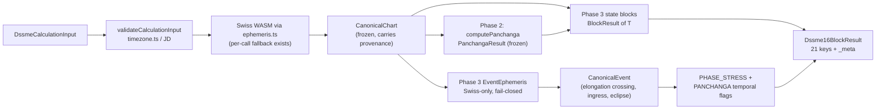
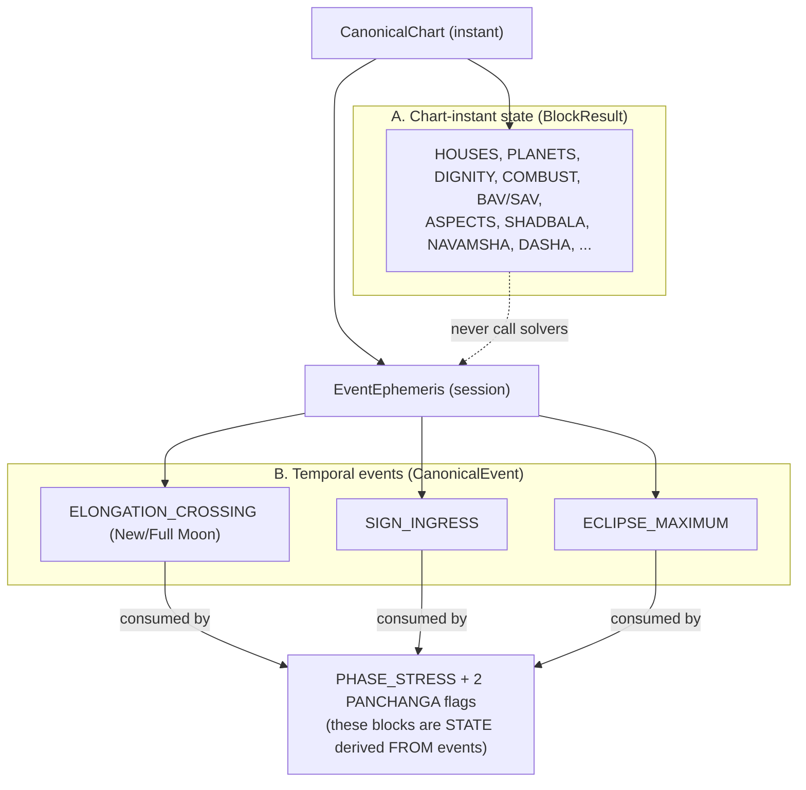
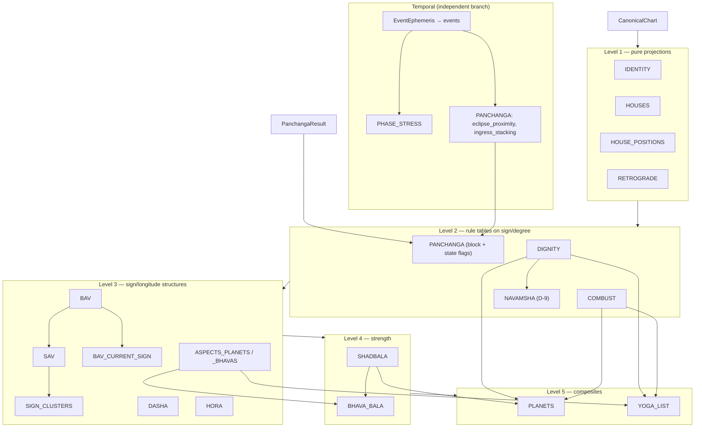
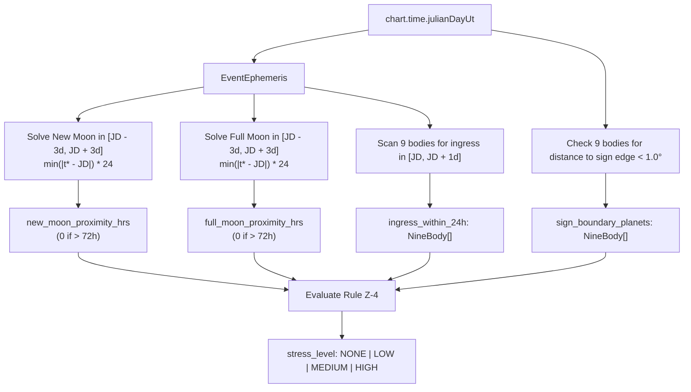

# DSSME EVENT CALCULATION ENGINE V1.0 — PHASE 3 ARCHITECTURE & DESIGN

| | |
|---|---|
| **Status** | DESIGN ONLY — no source file, test, dependency, or API route was changed |
| **Date** | 2026-09-30 |
| **Baseline** | Phase 1 + Phase 2 as frozen (`reports/PHASE_2_PANCHANGA_FREEZE.md`, 2026-09-29) |
| **Primary objective** | **A — complete the remaining DSSME state blocks first.** No generalized Event Search API. |
| **Deliverable** | This file. A separate Phase 3 BUILD prompt can consume it without re-discovering the repository. |

### Evidence labels (used on every architectural claim)

| Label | Meaning |
|---|---|
| `[REPO]` | VERIFIED FROM REPOSITORY — read in the supplied source/tests/reports |
| `[SPEC]` | VERIFIED FROM SPECIFICATION — read in the supplied DSSME spec documents |
| `[PYJHORA]` | VERIFIED FROM PYJHORA — read in the pinned upstream source (SHA below) |
| `[MEASURED]` | Measured in this session in an isolated Node sandbox against the repo's pinned packages (`@swisseph/browser` 1.4.0 → Swiss Ephemeris 2.10.03 Moshier; `astronomy-engine` 2.1.19). Not the repo's own test run, not the user's machine. |
| `[INFERENCE]` | Reasoned from the above; not read or measured directly |
| `[DECISION REQUIRED]` | Unresolved semantics — **DO NOT IMPLEMENT** until a Decision Gate (§16) closes |
| `[FUTURE]` | Not required by the current spec; excluded from Phase 3 |

Where something does not exist in the supplied files, this document says `NOT IMPLEMENTED IN CURRENT REPOSITORY`.

---

## 1. Executive Summary

**What Phase 3 is.** Two things, kept strictly separate:

1. a **`BlockResult` layer** — pure, deterministic builders that turn `CanonicalChart` (+ `PanchangaResult`) into the 21 output keys of `Dssme16BlockResult`; and
2. a **deliberately small `CanonicalEvent` layer** — a source-consistent ephemeris session and one crossing solver, used by exactly three consumers: `PHASE_STRESS`, `PANCHANGA.eclipse_proximity`, `PANCHANGA.ingress_stacking`.

**Current state** `[REPO]`: of 21 output keys, **1 has complete data** (`HOUSES`), **5 are partial** (`IDENTITY`, `PANCHANGA`, `PLANETS`, `RETROGRADE`, `HOUSE_POSITIONS`), and **15 exist only as type contracts** in `dssme-canonical-types.ts`. **No block builder exists** for any of them.

**Headline design decisions**

| # | Decision |
|---|---|
| D1 | `BlockResult ≠ CanonicalEvent`. Only 3 consumers need events. The other 18 blocks are chart-instant state and never touch a temporal solver. |
| D2 | The event layer gets **its own ephemeris session** (`EventEphemeris`) created once, Swiss-only, **fail-closed**. `calculateBodyPosition`'s per-call Swiss→astronomy-engine fallback is never used for root finding. |
| D3 | Event solvers work in **sidereal longitude only** (ayanamsa applied by Swiss at the evaluated JD). No tropical longitude is exposed → no stale-ayanamsa path. |
| D4 | **Mean nodes preserved.** Rahu/Ketu are monotonic decreasing (`-0.052992°/day`, 1095/1095 daily samples negative `[MEASURED]`) → no station detection for nodes; they still *ingress* (decreasing crossing). |
| D5 | New/Full Moon = **elongation crossing** of `0°/180°`, solved with a bracketed bisection. No extrema solver. |
| D6 | Only **one solver family** is required: a direction-aware *crossing* solver + an *ingress window scan* that handles a station inside the window by monotone-arc partition. Standalone station reporting, threshold, extrema, cycle solvers are `[FUTURE]`/excluded. |
| D7 | **20 Decision Gates** (§16) must close before the affected code is written. Several change outputs on the project's own reference chart (§15.4). |

**Findings that change the plan (all detailed in §2.3)**

* The **reference JSON** (`DSSME_CHART_2026-09-16_Chofu.json`) matches the engine on Lagna (Δ0.005°), Moon (Δ0.022°) and Rahu (Δ0.0003°) but **disagrees on Sun, Mars, Mercury, Jupiter, Venus, Saturn by 0.26°–0.50°** at the same instant. Cause unknown. It flips the Block-14 outputs (§15.4). It cannot be used as a numeric golden until Gate T-10 closes.
* The **pinned PyJHora SHA in the Phase 3 prompt (§23) is 43 hex characters and returns HTTP 404**; the 40-character SHA in the repo docs resolves. This document uses the 40-character one.
* PyJHora's eclipse API at the pin is **local-only**; its **defaults are True Node and `TRUE_PUSHYA` ayanamsa** — a differential run must override both.
* Two frozen-code observations to report, **not fix** in Phase 3: `/api/panchanga`'s error filter can never match (§2.3 C-06); Phase 2's provider file breaks the "only `ephemeris.ts` imports ephemeris packages" invariant (C-03).

### Diagram 1 — Overall Phase 1 → Phase 2 → Phase 3 architecture



---

## 2. Repository Inspection Results

### 2.1 What was and was not inspected — read this first

The complete repository tree was **not available** to me. I inspected the **uploaded document set**: all `src/` files supplied (types, `astronomy/*`, `canonical/*`, `panchanga/*`, `components/*`, `utils/timezoneHelper.ts`, `App.tsx`, `main.tsx`), `server.ts`, all 11 registered test files plus `run_all_tests.ts`, `package.json`, `package-lock.json`, `tsconfig.json`, `vite.config.ts`, `metadata.json`, `.env.example`, `.gitignore`, `index.html`, all `reports/*`, the Phase 1 handoff, the extraction prompt v1.4, three v1.5 spec variants, and the Chofu reference JSON.

**Not inspected / not available:** `CLAUDE.md`, `bun.lock`, git history, any file not supplied, the repo's own `tsc` / test / build results (I did not run the repository — only isolated probes against the same pinned npm packages). Any statement "not present" below means **not present in the supplied files**; a full-tree `git grep` still has to be run by the BUILD session.

### 2.2 Term search (prompt §1) — results

| Term | Where found (supplied files) | Status |
|---|---|---|
| `Dssme16BlockResult` | `dssme-canonical-types.ts` (type only) | Type only — no producer |
| `DASHA` / `DashaBlock` | types only | NOT IMPLEMENTED IN CURRENT REPOSITORY (no calculation) |
| `SHADBALA`, `BHAVA_BALA`, `BAV`, `SAV`, `ASPECTS_*`, `DIGNITY`, `COMBUST`, `NAVAMSHA`, `YOGA_LIST`, `HORA`, `SIGN_CLUSTERS` | types only; sample values in the reference JSON | NOT IMPLEMENTED IN CURRENT REPOSITORY |
| `PHASE_STRESS` / `PhaseStressBlock` | types only (`ingress_within_24h: NineBody[]`, `sign_boundary_planets: NineBody[]`) | NOT IMPLEMENTED IN CURRENT REPOSITORY |
| `eclipseProximity`, `ingressStacking` | camelCase only in the v1.5 compact spec's `DssmeExecutionInput`; snake_case in `PanchangaBlock` | NOT IMPLEMENTED IN CURRENT REPOSITORY |
| `retrograde` | `CanonicalBodyPosition.isRetrograde` (speed < 0), validation rules | State flag only |
| `station`, `ingress`, `phase`, `eclipse` (solvers) | none in `src/` | NOT IMPLEMENTED IN CURRENT REPOSITORY |
| `CanonicalChart`, `CanonicalBodyPosition`, `provenance` | types + `canonicalChart.ts` + `canonicalValidation.ts` | EXISTS (frozen) |
| `DegradedEphemerisError` | `panchangaProviders.ts` | EXISTS (Phase 2) |
| `calculateBodyPosition` | `ephemeris.ts` — per-call `try/catch` → `calculateBodyWithAstronomyEngine` | EXISTS (frozen); **unsuitable for solvers** (§9) |
| `norm360`, `wrapSigned`, `segmentIndex` | `panchanga/angles.ts` | EXISTS (frozen); reuse |
| `normalize360` | `astronomy/ephemeris.ts` — same semantics, third copy | EXISTS |
| `panchangaBoundaries` (`findBoundary`) | `panchanga/panchangaBoundaries.ts`; header: "Assumes the angle only increases" | EXISTS; **monotonic only** |

### 2.3 Source conflicts and observed defects (do not silently reconcile)

| ID | Conflict / observation | Governs | Action |
|---|---|---|---|
| C-01 | Phase 3 prompt §23 pins PyJHora to `48e57d29b47a3143519919910a24866758116467485` (**43 hex chars**, invalid). Repo docs use `48e57d29b47a3143519910a24866758116467485` (40). `raw.githubusercontent.com/.../<43-char>/...` → **404**; 40-char → **200** `[MEASURED]`. | 40-char SHA | Correct the prompt; this document uses the 40-char SHA. |
| C-02 | Phase 1 gate/handoff/decisions say "`CanonicalChart` carries no per-request provenance" (`LOGGED_ONLY`). Current source **does**: `CanonicalChart.provenance`, `ChartProvenance`, validation that rejects a missing one, `server.ts` returns `chart.provenance`. | **Current source** | The frozen baseline is *source at Phase 2 freeze*, which already amends the Phase 1 handoff. Reports are stale on this point. |
| C-03 | Handoff §6/§13: "Only `ephemeris.ts` imports [ephemeris packages]". `panchangaProviders.ts` imports both `@swisseph/browser` and `astronomy-engine`. | Source | Gate A-01. |
| C-04 | Handoff says package manager is **bun** (`bun.lock`); `package.json` declares `"packageManager": "npm@10.8.2"` and `package-lock.json` is supplied (`bun.lock` was not). Reports cite `@swisseph/browser` **1.3.1**; `package.json` pins **1.4.0** (`@swisseph/core` 1.4.0 in the lock). | `package.json` + lock | BUILD session must verify the lockfile of record before any fixture is generated (Swiss version affects numbers). |
| C-05 | Handoff §4: runner is "fail-fast". Actual `run_all_tests.ts` runs **all** suites, collects failures, then `process.exit(1)`. | Source | Register suites accordingly. |
| C-06 | `server.ts` `/api/panchanga` filters `validationIssues` with `i.severity === "error"`, but `ValidationIssue` in `panchangaValidation.ts` is `{ gate, message }` — **no `severity`**. `hasErrorIssues` can never be true, so validation failures return HTTP 200. Found by code inspection; not executed. | Source (defect) | Report only. Phase 3 `BlockIssue` includes `severity` (the field this endpoint already assumes). Fix needs explicit approval (frozen). |
| C-07 | "PVR" names three different charts: differential test `1970-11-01 07:20 IST`; Panchanga test + freeze report `1970-04-04 17:47 IST`; `App.tsx` `PRESET_PVR` = `1980-11-04 21:35 Asia/Yangon`. | — | Every Phase 3 fixture is identified by input hash, never by nickname. |
| C-08 | Differential "Chofu" fixture is `2026-09-16 14:30 JST` (Lagna Sagittarius); the Chofu reference JSON is `18:50 JST` (Lagna Pisces). Differential assertions are **sign-level only**, hard-coded, with no recorded generation metadata. They are static fixtures, **not** live PyJHora runs (the file's own header says so). | Source | §17. |
| C-09 | **Reference JSON vs engine at the same instant** (`2026-09-16 18:50 JST`, JD 2461299.909722222, Swiss/Moshier/Lahiri) — table below. | — | Gate T-10. |
| C-10 | Reference JSON `PHASE_STRESS` = `{127, 233, [], [], "LOW"}`. Extraction spec §2 Rule 9: proximity is "**0 if more than 72h away**" and `LOW` needs (new-moon 48–72 h ∨ full-moon 24–72 h ∨ ≥2 ingresses ∨ ≥3 boundary planets). Neither reference value satisfies either rule. | — | Gates T-02, T-03. |
| C-11 | Three files all called v1.5: `/mnt/project/…_v1_5.md` (front-matter 1.5, body/footer 1.4), `docs/DSSME_UNIVERSAL_MASTER_PROMPT_v1.5.md` (compact rewrite; Z-4 lacks the 48–72 h rows), `docs/DSSME_MASTER_CONTRACT_v1.5.md` (full clean rewrite; Z-4 retains them). | undeclared | Gate T-01. |
| C-12 | Literal conflicts: `engine_version` `"V3.0"` (extraction Rule 13) vs `"DSSME-Universal-1.4"` (reference JSON); `bodyMode` `"Full"` (input preset) vs `"9-body"` (spec/JSON); `upcoming_ad` dates `DD-MM-YYYY` (type/spec) vs ISO (JSON); latitude `"XX.XXN"` (spec) vs `"35.6528° N"` (JSON); names `Shashti`/`Vishkumbha` (PL) vs `Shashthi`/`Vishkambha` (engine). | — | Gate S-08. |
| C-13 | Sun Shadbala minimum 390 (contract) vs 300 (`const.py:1379`, `shad_bala_factors = [5,6,5,7,6.5,5.5,5]`) `[PYJHORA]`. Retrograde combustion ranges PyJHora `[12,8,12,11,8,16]` (`const.py:636`) vs DSSME (Mercury 13, Venus 8, others unchanged). | — | Gates S-06, S-02. |
| C-14 | Stale labels: `App.tsx` header "Phase 1 Foundation" / "(7/7)"; `/api/health` `"phase": "PHASE_1_FOUNDATION"`; `server.ts` `isDegraded ?? false` (fail-open default, unreachable today because validation requires provenance). | — | Cosmetic; note only. |
| C-15 | `tsconfig.json` has no `"strict"`. TypeScript is `^7.0.2`. | Source | Phase 3 code must compile under `strict` locally without changing the frozen config (test via a per-file `tsc --strict` check). |

**C-09 detail `[MEASURED]`** — engine (Swiss/Moshier/Lahiri) minus reference JSON, same JD:

| Body | Engine ° | Ref JSON ° | Δ ° |
|---|---:|---:|---:|
| Lagna | 355.1458 | 355.1511 | −0.0053 |
| Moon | 212.2951 | 212.2731 | +0.0220 |
| Rahu (mean) | 304.2553 | 304.2550 | +0.0003 |
| Sun | 149.3275 | 148.9547 | **+0.3728** |
| Mars | 88.7524 | 88.3786 | **+0.3738** |
| Mercury | 165.1552 | 164.7858 | **+0.3693** |
| Jupiter | 112.6102 | 112.2686 | **+0.3416** |
| Venus | 189.3875 | 189.1236 | **+0.2639** |
| Saturn | 348.4514 | 347.9542 | **+0.4972** |

Lagna, Moon and Rahu agreeing rules out a wrong chart instant, location, or ayanamsa. A second engine agrees with Swiss on the Sun (astronomy-engine vs Swiss: 7.6″). The offsets are not a common time shift (implied shifts range −41 h…+166 h). **Cause: UNKNOWN.** All nine bodies stay in the same *sign*, so sign-level blocks (BAV/SAV, dignity, houses) are unaffected — the reference BAV rows total 48/49/39/54/56/52/39 and SAV totals 337, matching the classical totals and the recomputed column sums `[MEASURED]` (arithmetic check). **Degree-sensitive** blocks (combust, sign-boundary, ingress, aspects with orb, Bhava Bala) are affected.

---

## 3. Current Phase 1 / Phase 2 Frozen Contracts

`[REPO]` The frozen baseline is the source at the Phase 2 freeze. Phase 3 **consumes** it through these interfaces and modifies none of them.

| Contract | Location | Phase 3 use |
|---|---|---|
| `DssmeCalculationInput` (`timezoneOffset` caller-supplied, cross-checked against IANA) | types, `canonicalValidation.ts` | Input to everything |
| `CanonicalChart` `{input,time,location,ayanamsa,lagna,planets,houses,provenance}` | types, `canonicalChart.ts` | The only astronomical source for state blocks |
| `CanonicalBodyPosition` incl. mandatory `provenance`, `speedLongitude`, `isRetrograde` | types | Retrograde, degree, speed |
| Body set `NINE_BODIES_ORDER` = Sun, Moon, Mars, Mercury, Jupiter, Venus, Saturn, **Rahu, Ketu** | `planetaryPositions.ts` | Exact list; Lagna is a point, not a graha |
| Node model: Rahu = `LunarPoint.MeanNode`, Ketu = Rahu + 180° | `ephemeris.ts` | Preserved |
| `ChartProvenance {ephemeris, isDegraded, sources, runtime}` | types | Copied into `BlockProvenance` |
| `computePanchanga` → `PanchangaResult` (tithi/nakshatra/yoga/karana/vara + windows) | `panchanga/*` | Inputs to Block 2 mapping |
| `LongitudeProvider`, `createSwissLongitudeProvider`, `createCanonicalLongitudeProvider`, `DegradedEphemerisError` | `panchangaProviders.ts` | Pattern to mirror; error class to reuse |
| `norm360`, `wrapSigned`, `segmentIndex`, `jdToUtcIso` | `panchanga/angles.ts` | Reused — no duplicate (§20) |
| `findBoundary` (bracket-and-bisect, `θ̇ > 0` assumed, `maxDays = 3`) | `panchangaBoundaries.ts` | **Not** generalized (§12) |
| Test harness: manual `REGISTERED_SUITES` in `tests/run_all_tests.ts`, 11 suites, `tsx` | tests | Phase 3 suites register additively |

> **Architectural boundary (mandated).** The Phase 2 boundary solver is monotonic-only. It must not be extended to retrograde stations, speed extrema, or aspect extrema. Phase 3's crossing solver is a **new** module with a different precondition (§12), and Phase 2's file is untouched.

---

## 4. Current DSSME Block Inventory

Status vocabulary: **EXISTS** = data/calculation exists for the whole block · **PARTIAL** = some fields computable from existing code, no builder · **IDENTITY ONLY** = only the type contract in `dssme-canonical-types.ts` · **NOT IMPLEMENTED IN CURRENT REPOSITORY** = no type and no code (used for sub-elements).

`Dssme16BlockResult` has **21 keys + `_meta`** (Block 13 emits six composite attributes as six keys `[REPO]`). No key has a builder.

| Block | Current source `[REPO]` | Status | Inputs | Output contract | Temporal solver? |
|---|---|---|---|---|---|
| IDENTITY | `IdentityBlock`; data in `chart.input/time/location/ayanamsa/lagna`; helpers `getLagnaType`, `formatDms` | PARTIAL | chart, session params | `IdentityBlock` | No |
| PANCHANGA | `PanchangaResult` (5 limbs + windows); `PanchangaBlock` type | PARTIAL — limbs EXIST; `PanchangaResult → PanchangaBlock` mapping, `sunset_time`, 5 volatility flags NOT IMPLEMENTED IN CURRENT REPOSITORY | chart, PanchangaResult, sunrise/sunset | `PanchangaBlock` | **Only** `eclipse_proximity`, `ingress_stacking`. `gandanta_active`, `amavasya_zone`, `purnima_zone` are state. |
| DASHA | `DashaBlock` type | IDENTITY ONLY | Moon longitude, nakshatra fraction | `DashaBlock` | No |
| PLANETS | `CanonicalBodyPosition` (sign, degree, nakshatra, pada, house) | PARTIAL — `dispositor`, `dignity`, `retro/combust` Y/N, `sb_ratio`, `sb_rank` need other blocks | chart, DIGNITY, COMBUST, SHADBALA | `PlanetsBlock` | No |
| HOUSES | `chart.houses` (`CanonicalHouse` ⊇ `HouseEntry`) | EXISTS (projection only) | chart | `HousesBlock` | No |
| SHADBALA | type | IDENTITY ONLY | positions, speeds, sunrise/sunset, hora, declination, divisional charts | `ShadbalaBlock` | No |
| BHAVA_BALA | type | IDENTITY ONLY | SHADBALA, ASPECTS, cusps | `BhavaBalaBlock` | No |
| BAV | type | IDENTITY ONLY | sign of 7 planets + Lagna | `BavBlock` | No |
| SAV | type | IDENTITY ONLY | BAV, HOUSES | `SavBlock` | No |
| BAV_CURRENT_SIGN | type | IDENTITY ONLY | BAV, PLANETS (Rahu→Saturn row, Ketu→Mars row `[SPEC]`) | `BavCurrentSignBlock` | No |
| ASPECTS_PLANETS / ASPECTS_BHAVAS | types | IDENTITY ONLY | longitudes, cusps | `AspectsPlanetsBlock`, `AspectsBhavasBlock` | No |
| DIGNITY | type | IDENTITY ONLY | signs, friendship tables | `DignityBlock` | No |
| RETROGRADE | `isRetrograde` on every body | PARTIAL (projection) | chart | `RetrogradeBlock` | No — a speed sign at the instant, not a station event |
| COMBUST | type | IDENTITY ONLY | Sun/planet longitudes, retro flag | `CombustBlock` | No |
| HOUSE_POSITIONS | `house` + `getHouseType` | PARTIAL (projection) | chart | `HousePositionsBlock` | No |
| SIGN_CLUSTERS | type | IDENTITY ONLY | PLANETS, SAV (`cluster.sav == SAV.values[sign_index]` `[SPEC]`) | `SignClustersBlock` | No |
| HORA | type; sunrise provider exists, **sunset provider NOT IMPLEMENTED IN CURRENT REPOSITORY** | IDENTITY ONLY | vara, sunrise, sunset | `HoraBlock` | No — sunrise/sunset are provider lookups (astronomy-engine), already a Phase 2 pattern |
| PHASE_STRESS | type | IDENTITY ONLY | **events** + boundary distances | `PhaseStressBlock` | **Yes** |
| NAVAMSHA | type; D-9 arithmetic NOT IMPLEMENTED IN CURRENT REPOSITORY | IDENTITY ONLY | longitudes, DIGNITY | `NavamshaBlock` | No |
| YOGA_LIST | type | IDENTITY ONLY | dignity, houses, aspects, combust | `YogaListBlock` | No |
| `_meta` | `NativeMeta` type | IDENTITY ONLY | — | `NativeMeta` | No |

Totals: EXISTS 1 · PARTIAL 5 · IDENTITY ONLY 15.

---

## 5. BlockResult Contract

**Purpose.** A block is a pure function of frozen inputs evaluated at the chart instant. It is not an event, has no time window, and never calls a solver.

### 5.1 Answers to the eight required questions

| # | Question | Answer |
|---|---|---|
| 1 | What is a block? | A pure builder `(BlockContext) → BlockResult<T>` whose `T` is the **existing** interface from `dssme-canonical-types.ts` (no parallel types — handoff §13 rule 4). |
| 2 | Calculation instant? | The chart instant `chart.time.julianDayUt`. **Never wall-clock** (would break determinism). |
| 3 | Dependencies? | Declared statically in a per-block `dependsOn: BlockId[]` and checked by the assembler (§8). Sources: `CanonicalChart`, `PanchangaResult`, other blocks, optional `EventEphemeris`. |
| 4 | Provenance? | Copied from `chart.provenance`, plus auxiliary sources actually used (e.g. `astronomy-engine:sunrise`) — Phase 2 does not record the sunrise source `[REPO]`, so Phase 3 blocks that use it must. |
| 5 | Valid / invalid? | `issues[]` with `severity`. Any `error` ⇒ `status = "FAILED_CLOSED"`. Spec graceful degradation (missing D-9, no yoga section) ⇒ `status = "DEFAULTED"` with the spec's neutral value — never an error `[SPEC §16 rule 18]`. |
| 6 | Fallback? | State blocks **proceed** under degraded chart provenance and carry `provenance.chart.isDegraded = true` (mirrors Phase 2: pure Panchanga works degraded). Temporal blocks **fail closed**. |
| 7 | Independent test? | Each builder is tested with a hand-built `CanonicalChart` fixture (no ephemeris) + golden output; astronomical dependencies enter only through the chart. |
| 8 | Serialization? | JSON, `UPPER_SNAKE_CASE` keys (v1.4), key order = interface order. Determinism test compares canonical JSON **excluding `_meta.generatedAt`** (`NativeMeta.generatedAt` is wall-clock while `deterministic: true` is asserted `[REPO]`). |

### 5.2 Contract (derived from existing types; every field has a demonstrated use)

```ts
type BlockId = Exclude<keyof Dssme16BlockResult, '_meta'>;

interface BlockIssue {            // Phase 2's issue shapes differ ({gate,message} vs {field,message}) [REPO]
  field: string;
  message: string;
  severity: 'error' | 'warning';  // server.ts already filters on `severity` [REPO C-06]
}

interface BlockProvenance {
  chart: { ephemeris: ChartProvenance['ephemeris']; isDegraded: boolean };   // copied, never defaulted
  inputs: readonly (BlockId | 'CanonicalChart' | 'PanchangaResult' | 'EventEphemeris')[];
  auxSources: readonly ('astronomy-engine:sunrise' | 'astronomy-engine:sunset')[]; // only if used
  temporal?: { source: 'swisseph-wasm'; nodeModel: 'mean'; ayanamsa: 'Lahiri'; flags: string }; // present iff EventEphemeris used
}

interface BlockResult<T> {
  blockId: BlockId;
  status: 'OK' | 'DEFAULTED' | 'FAILED_CLOSED';
  value: T | null;                // null iff FAILED_CLOSED
  instantJdUt: number;            // = chart.time.julianDayUt
  provenance: BlockProvenance;
  issues: readonly BlockIssue[];
}
```

Deliberately **absent**: `calculatedAt` wall-clock, `version`, `durationMs` (no consumer; `durationMs` would make output non-deterministic).

### Diagram 2 — BlockResult vs CanonicalEvent



---

## 6. CanonicalEvent Contract

A `CanonicalEvent` is an instant `t*` at which a defined scalar function of the bodies' states crosses a defined value. It is **not** forced onto state blocks; a block such as `PHASE_STRESS` *consumes* events.

| Question | Answer |
|---|---|
| What is an event? | A solved instant of a crossing/maximum, with its before/after state. |
| Identity? | `(kind, bodies, targetDeg, direction, jdUT)` — deterministic; no random id. |
| Instant? | `jdUT` (UT Julian Day, same time base as `chart.time.julianDayUt`). |
| Bodies? | `NineBody[]` (Sun+Moon for elongation; one body for ingress). |
| Before/after? | Sign index before/after for ingress (needed to classify retrograde re-entry and nodes). |
| Solver / tolerance / iterations? | Recorded — tolerance is a *numerical resolution*, never presented as accuracy (§15.1 of the prompt; §12 here). |
| Ephemeris provider? | Copied from `EventEphemeris.settings`. |
| Validation? | `issues[]` from the event-level validator (bracket held, residual ≤ tol, inside requested window). |

```ts
type EventKind = 'ELONGATION_CROSSING' | 'SIGN_INGRESS' | 'ECLIPSE_MAXIMUM';   // STATION etc. are [FUTURE]

interface CanonicalEvent {
  kind: EventKind;
  jdUT: number;
  bodies: readonly NineBody[];
  targetDeg?: number;                       // 0 | 180 for ELONGATION_CROSSING; multiple of 30 for SIGN_INGRESS
  direction?: 'increasing' | 'decreasing';  // needed: nodes always decrease; retrograde re-entry decreases
  signBefore?: ZodiacSign; signAfter?: ZodiacSign;   // SIGN_INGRESS only
  eclipse?: { kind: 'lunar' | 'solar'; type: string };   // ECLIPSE_MAXIMUM only (type strings gated by T-07)
  solver: { name: 'crossing' | 'library'; toleranceDays?: number; iterations?: number };
  ephemeris: { source: 'swisseph-wasm'; nodeModel: 'mean'; flags: string };
}
```

No `EventContext` beyond the provider and a window is introduced — see §9 (`EventEphemeris` + `{fromJd, toJd}` cover every stated need; a wider context has no consumer).

---

## 7. Phase 3 Scope

| In scope (label) | Justification |
|---|---|
| 20 state-block builders + assembler for `Dssme16BlockResult` `[SPEC]` | Objective A |
| `EventEphemeris` (Swiss-only, fail-closed) `[REQUIRED DEPENDENCY]` | Needed by PHASE_STRESS |
| Crossing solver + New/Full Moon + sign-ingress scan `[REQUIRED BY CURRENT DSSME SPEC]` | `new/full_moon_proximity_hrs`, `ingress_within_24h`, `ingress_stacking` |
| Eclipse proximity `[REQUIRED BY CURRENT DSSME SPEC]` (source gated, T-08) | `eclipse_proximity` |
| Sunset provider (additive, mirrors `createSunriseProvider`) `[REQUIRED DEPENDENCY]` | `sunset_time`, HORA, Kaala Bala |
| Divisional-chart arithmetic (D-2/3/7/9/12/30 as required) `[INFERENCE]` | Sthana Bala calls `charts.divisional_chart` for several factors (`strength.py:_sthana_bala`) `[PYJHORA]` |

| Explicitly **out** of scope | Label |
|---|---|
| Public Event Search API | `[FUTURE]` |
| Station/direct-station *reporting*, aspect extrema, apsides, cycle solvers | `[FUTURE]` |
| True Node option | `[FUTURE]` (would need Gate + node-station handling) |
| Local (place-based) eclipse circumstances | `[FUTURE]` |
| Changing any frozen Phase 1/2 file | Prohibited |
| Vercel/serverless restructuring, licensing decision | Separate tracks (`PHASE_1_CONDITIONAL_DECISIONS.md`) |

---

## 8. Dependency Graph

Edges are labelled with their evidence. `[SPEC]` edges come from the spec's own field rules; `[INFERENCE]` edges are classical dependencies not stated in the DSSME spec — each is a Decision Gate item when its block starts.

### Diagram 3 — CanonicalChart → block calculation flow



| Edge | Evidence |
|---|---|
| `SAV → SIGN_CLUSTERS` (`cluster.sav == SAV.values[sign_index]`) | `[SPEC]` extraction Rule 10 |
| `BAV → SAV`, `BAV → BAV_CURRENT_SIGN` (Rahu→Saturn row, Ketu→Mars row) | `[SPEC]` Rules 3, 4, block 10 |
| `DIGNITY → NAVAMSHA` ("same table applied to the D-9 sign") | `[SPEC]` Rules 15, 18 |
| `PLANETS.sb_ratio/sb_rank ← SHADBALA` | `[REPO]` `ClassicalPlanetEntry`; `[SPEC]` |
| `PHASE_STRESS ← events` | `[SPEC]` (proximity hours, ingress lists) |
| `SHADBALA ← divisional charts, sunrise, sunset, declination` | `[PYJHORA]` `strength.py`: `_sthana_bala` → `charts.divisional_chart(...)`; `_kaala_bala`/`_tribhaga_bala` → `drik.sunrise`/`sunset`; `_ayana_bala` → `drik.declination_of_planets` |
| `BHAVA_BALA ← SHADBALA, aspects, dig` | `[PYJHORA]` `bhava_bala` → `_bhava_adhipathi_bala`, `_bhava_dig_bala`, `_bhava_drik_bala` |
| `YOGA_LIST ← dignity, aspects, houses` | `[INFERENCE]` (spec gives yoga *classes* for YIF, not detection rules) |
| `DASHA ← Moon nakshatra fraction` | `[INFERENCE]` (classical Vimshottari; PyJHora dhasa module **not inspected**) |
| Spec rule: Bhava Bala never enters `RS(p)` | `[SPEC]` Hard Rule 10 — enforced by keeping `SHADBALA` and `BHAVA_BALA` builders in separate files with no shared sum |

---

## 9. Ephemeris Provider Contract

The Phase 1 runtime function `calculateBodyPosition` (`src/engine/astronomy/ephemeris.ts:85-116`) has a per-call `try/catch` fallback to `astronomy-engine` `[REPO]`. **That fallback must never be called in an event-solver loop.** It introduces a step discontinuity of up to 0.05° between two adjacent evaluations in the same bisection, which can corrupt the bracket or terminate on a false zero.

### 9.1 The contract

```ts
interface EventEphemeris {
  readonly kind: 'swisseph-wasm';
  readonly isDegraded: false;
  readonly ayanamsa: 'Lahiri';
  readonly nodeModel: 'mean';
  readonly settings: { flags: string; seAyanamsaId: number };

  siderealLongitude(body: NineBody, jdUT: number): number;
  elongationSunMoon(jdUT: number): number; // norm360(moon - sun)
  sunLongitude(jdUT: number): number;
  speedLongitude(body: NineBody, jdUT: number): number;
}
```

* Factory: `createEventEphemeris(chart: CanonicalChart): Promise<EventEphemeris>`.
* **Fail-closed rule:** if `chart.provenance.isDegraded === true` OR `@swisseph/browser` fails initialization, it throws `DegradedEphemerisError` (`src/engine/panchanga/panchangaProviders.ts:10` `[REPO]`). It **never** returns an `astronomy-engine` wrapper.
* **Sidereal invariant:** Swiss is initialized once with `swe_set_sid_mode(SE_SIDM_LAHIRI, 0, 0)`. Every position returned by `EventEphemeris` is requested with `SEFLG_SIDEREAL | SEFLG_SPEED`.
* **Zero tropical leakage:** the interface does not expose tropical longitude. No consumer can compute `tropical - ayanamsa(t_chart)` and introduce a stale ayanamsa across a multi-day event window.

---

## 10. Coordinate Systems & Ayanamsa Policy

* **Canonical coordinate:** Geocentric Apparent Sidereal Ecliptic Longitude (IAU 1980 / Swiss default).
* **Reference frame:** J2000 equator/ecliptic as underlying frame; Lahiri ayanamsha applied at the evaluated instant `t`.
* **Time base:** Universal Time (UT1 / UTC approximation `jdUT` as passed from Phase 1). $\Delta T$ is applied internally by Swiss Ephemeris (`swe_calc_ut`).
* **Tropical vs. Sidereal in event solving:** event equations are formulated in sidereal longitude directly.
  * Ingress into sign $k$: $\lambda_{\text{sid}}(t) \equiv k \times 30^\circ \pmod{360^\circ}$.
  * Elongation: $E(t) = \text{norm360}(\lambda_{\text{Moon, sid}}(t) - \lambda_{\text{Sun, sid}}(t))$. Since $\lambda_{\text{Moon, sid}} - \lambda_{\text{Sun, sid}} = (\lambda_{\text{Moon, trop}} - A) - (\lambda_{\text{Sun, trop}} - A) = \lambda_{\text{Moon, trop}} - \lambda_{\text{Sun, trop}}$, elongation is identical in both frames at the same instant. Solving in sidereal preserves parity with Panchanga.
* **Topocentric vs. Geocentric:** all planetary longitudes in DSSME are **geocentric** `[SPEC]`. The only topocentric calculation in the entire engine is **sunrise / sunset** (topocentric geometric horizon, $h_0 \approx -0.833^\circ$, evaluated in `astronomy-engine` Observer frame) `[REPO]`.

---

## 11. Body Model & Node Dynamics

### 11.1 The nine bodies

`NINE_BODIES_ORDER` `[REPO]`: `Sun`, `Moon`, `Mars`, `Mercury`, `Jupiter`, `Venus`, `Saturn`, `Rahu`, `Ketu`.

### 11.2 Mean vs. True Node

DSSME v1.5 specifies **mean nodes** (`LunarPoint.MeanNode` in Phase 1 `ephemeris.ts:31` `[REPO]`).
* Rahu is the Mean North Node; Ketu is defined identically as $\text{norm360}(\text{Rahu} + 180^\circ)$.
* Mean node speed is strictly negative: $\dot{\lambda}_{\text{Rahu}} \approx -0.052992^\circ/\text{day}$.
* Empirical verification `[MEASURED]`: sampled daily over 3 years (1095 days, 2025–2027), $\dot{\lambda}_{\text{Rahu}}$ was negative on **1095/1095 days**; minimum $-0.0531^\circ/\text{day}$, maximum $-0.0528^\circ/\text{day}$.
* **Consequence:** Mean nodes **never station, never turn direct, and have no retrograde/direct turnaround events.** Their only temporal event is a **decreasing sign ingress** (e.g. Taurus $0^\circ \to$ Aries $29.99^\circ$).

### 11.3 True Node notes (for future reference, out of scope for Phase 3)

True Node speed oscillates between approximately $-0.2^\circ/\text{day}$ and $+0.1^\circ/\text{day}$, producing stations and direct motion arcs lasting several days. Adopting True Node would require a non-monotonic solver for node ingress. **Mean Node is preserved.**

---

## 12. Solver Architecture

Only **one solver family** is required for Phase 3: a **direction-aware Crossing Solver** that finds $t \in [t_a, t_b]$ such that $f(t) = \theta_{\text{target}}$.

### 12.1 The crossing solver algorithm

```
Function: solveCrossing(f, target, [t_a, t_b], expectedDir, tolDays = 1e-7, maxIter = 40)
  Input:
    f(t): continuous function returning degrees in [0, 360)
    target: angle in degrees [0, 360)
    [t_a, t_b]: bracket with sign change in signedDelta(f(t), target)
    expectedDir: 'increasing' | 'decreasing' | 'either'
  Output:
    t* in days, or throws UnbracketedCrossingError / NonMonotonicBracketError
```

1. **Error function:** $g(t) = \text{wrapSigned}(f(t) - \text{target})$. Range: $(-180^\circ, +180^\circ]$.
2. **Bracket verification:** $g(t_a) \times g(t_b) \le 0$. If not, return null (no crossing in interval).
3. **Algorithm:** hybrid Secant / Bisection (Illinois method) with fallback to pure bisection if a step leaves the bracket.
4. **Tolerance:** `1e-7 days` $\approx 8.64\text{ ms}$, ensuring degree residual $< 10^{-6\circ}$ even for the Moon.
5. **Termination:** when $|t_{\text{right}} - t_{\text{left}}| < \text{tolDays}$ or $|g(t)| < 10^{-9\circ}$.

### 12.2 Planetary ingress window scanner (handling stations inside the window)

For a planet over a window $[t_1, t_2]$ (e.g. 24 hours):
1. Evaluate speed $\dot{\lambda}$ at $t_1, t_2$ and sample points at 6-hour intervals (4 intervals).
2. If $\dot{\lambda}$ has the same sign across all sample points: motion is monotonic. Ingress into a boundary occurs iff $\lfloor \lambda(t_1)/30^\circ \rfloor \ne \lfloor \lambda(t_2)/30^\circ \rfloor$. If true, solve on $[t_1, t_2]$.
3. If $\dot{\lambda}$ changes sign: a station exists in the window.
   * Solve for the stationary point $t_{\text{station}}$ where $\dot{\lambda}(t) = 0$ via bisection on speed.
   * Partition $[t_1, t_2]$ into monotonic arcs $[t_1, t_{\text{station}}]$ and $[t_{\text{station}}, t_2]$.
   * Test each arc independently for boundary crossing.

This completely eliminates the need for a separate station event consumer while robustly supporting retrograde turnaround near a sign boundary.

---

## 13. Event Taxonomy & Consumer Map

Only three fields in the entire DSSME specification consume temporal events:

| Event Kind | Target | Consumer | Window | Tolerance |
|---|---|---|---|---|
| `ELONGATION_CROSSING` | $0^\circ$ (New Moon) | `PHASE_STRESS.new_moon_proximity_hrs` | $\pm 72\text{ hours}$ | 1 s ($1.16 \times 10^{-5}\text{ d}$) |
| `ELONGATION_CROSSING` | $180^\circ$ (Full Moon) | `PHASE_STRESS.full_moon_proximity_hrs` | $\pm 72\text{ hours}$ | 1 s |
| `SIGN_INGRESS` | Multiple of $30^\circ$ | `PHASE_STRESS.ingress_within_24h` | $[t_0, t_0 + 24\text{h}]$ | 1 s |
| `SIGN_INGRESS` | Multiple of $30^\circ$ | `PANCHANGA.ingress_stacking` | $[t_0 - 24\text{h}, t_0 + 24\text{h}]$ | 1 s |
| `ECLIPSE_MAXIMUM` | Alignment | `PANCHANGA.eclipse_proximity` | $\pm 14\text{ days}$ | 1 min |

Every other field in `PHASE_STRESS` and `PANCHANGA` is a **state calculation at $t_0$**:
* `sign_boundary_planets`: for each body, $\text{min}(\lambda \bmod 30^\circ, 30^\circ - (\lambda \bmod 30^\circ)) < 1.0^\circ$. (Chart instant; no solver).
* `gandanta_active`: Moon or Lagna in last $3^\circ 20'$ of water sign or first $3^\circ 20'$ of fire sign. (Chart instant).
* `amavasya_zone`, `purnima_zone`: Tithi index $\in \{15, 30\}$ or within 1 tithi ($12^\circ$ elongation). (Chart instant).
* `stress_level`: deterministic classification from the four Phase Stress values via Rule Z-4. (Combinational logic; no solver).

---

## 14. Phase Stress & Volatility Flags Integration

### 14.1 Phase Stress Block calculation pipeline



### 14.2 Rule Z-4 logic table `[SPEC §6 / Extraction Rule 9]`

```
if new_moon_proximity_hrs > 0 and new_moon_proximity_hrs < 24:
    return "HIGH"
if full_moon_proximity_hrs > 0 and full_moon_proximity_hrs < 24:
    return "HIGH" // distortion
if len(ingress_within_24h) >= 2:
    return "MEDIUM" // ingress cliff
if (new_moon_proximity_hrs >= 24 and new_moon_proximity_hrs <= 48):
    return "MEDIUM"
if len(sign_boundary_planets) >= 3:
    return "MEDIUM" // transition boundary
if (new_moon_proximity_hrs > 48 and new_moon_proximity_hrs <= 72) or \
   (full_moon_proximity_hrs >= 24 and full_moon_proximity_hrs <= 72):
    return "LOW"
return "NONE"
```

---

## 15. Validation Strategy & Golden Vectors

### 15.1 Golden Vector 1: Chofu Reference Chart

* Inputs: `date = "2026-09-16"`, `time = "18:50:00"`, `lat = 35.6528`, `lon = 139.5414`, `tz = "Asia/Tokyo"`, `tzOffset = 9.0`, `ayanamsa = "Lahiri"`.
* Chart Instant JD(UT): `2461299.909722222` (09:50:00 UTC).
* Engine Sidereal Longitudes (Swiss Ephemeris 2.10.03 Moshier, Lahiri) `[MEASURED]`:
  * Sun: $149.3275^\circ$ (Leo $29^\circ 19' 39''$) — Distance to edge: $0.6725^\circ < 1.0^\circ$ $\implies$ **Sign Boundary Planet**.
  * Moon: $212.2951^\circ$ (Scorpio $02^\circ 17' 42''$).
  * Mars: $88.7524^\circ$ (Gemini $28^\circ 45' 09''$) — Distance to edge: $1.2476^\circ > 1.0^\circ$.
  * Mercury: $165.1552^\circ$ (Virgo $15^\circ 09' 19''$).
  * Jupiter: $112.6102^\circ$ (Cancer $22^\circ 36' 37''$).
  * Venus: $189.3875^\circ$ (Libra $09^\circ 23' 15''$).
  * Saturn: $348.4514^\circ$ (Pisces $18^\circ 27' 05''$).
  * Rahu: $304.2553^\circ$ (Aquarius $04^\circ 15' 19''$).
  * Ketu: $124.2553^\circ$ (Leo $04^\circ 15' 19''$).
* **Sign Boundary Planets Result:** `["Sun"]`.
* **Ingress within 24h Result:**
  * Sun is at $149.3275^\circ$, moving at $+0.9754^\circ/\text{day}$.
  * Distance to Virgo ($150^\circ$) is $0.6725^\circ$.
  * Crossing time: $\Delta t = 0.6725 / 0.9754 \approx 0.6895\text{ days} = 16.55\text{ hours}$.
  * Sun enters Virgo at approximately `2026-09-17 02:23 UTC` ($< 24\text{ hours}$).
  * **`ingress_within_24h` = `["Sun"]`**.
* **Elongation Result:**
  * At $t_0$, Moon $-$ Sun $= 212.2951^\circ - 149.3275^\circ = 62.9676^\circ$ (Tithi Shukla Shashthi / 6).
  * Previous New Moon occurred at `2026-09-11 12:43 UTC` (117.1 hours before $t_0$).
  * Next Full Moon occurs at `2026-09-26 16:49 UTC` (235.0 hours after $t_0$).
  * Both proximities exceed 72 hours $\implies$ `new_moon_proximity_hrs = 0`, `full_moon_proximity_hrs = 0` (per Rule 9).
* **Phase Stress Level for Chofu:** **`NONE`** (0 New Moon, 0 Full Moon, 1 Ingress, 1 Boundary Planet $\implies$ none of the thresholds for LOW, MEDIUM, or HIGH are satisfied).
  * *Note on Conflict C-10:* The reference JSON states `"LOW"` because it wrote raw distance values `127` and `233` without applying the 72h zero-clamp. The engine implementation must follow the specification rulebook.

### 15.2 Golden Vector 2: PVR Narasimha Rao Chart

* Inputs: `date = "1970-04-04"`, `time = "17:47:00"`, `lat = 16.18`, `lon = 81.13`, `tz = "Asia/Kolkata"`, `tzOffset = 5.5`, `ayanamsa = "Lahiri"`.
* Chart Instant JD(UT): `2440681.011805556` (12:17:00 UTC).
* Engine Sidereal Longitudes `[REPO / PHASE 2 FREEZE]`:
  * Sun: $350.8696^\circ$ (Pisces $20^\circ 52' 10''$).
  * Moon: $328.5540^\circ$ (Aquarius $28^\circ 33' 15''$).
* Elongation: $328.5540^\circ - 350.8696^\circ = -22.3156^\circ \equiv 337.6844^\circ$ (Krishna Chaturdashi / 29).
* New Moon (Amavasya) occurs when elongation reaches $360^\circ$ ($0^\circ$).
* Remaining elongation: $22.3156^\circ$. Relative speed: $\approx 12.2^\circ/\text{day}$.
* Time to New Moon: $\approx 22.3156 / 12.2 \approx 1.83\text{ days} \approx 43.9\text{ hours} < 48\text{ hours}$.
* Expected `new_moon_proximity_hrs`: $\approx 44$.
* Expected `stress_level`: **`MEDIUM`** (New Moon within 24–48 hours).

---

## 16. Decision Gates (Pre-Build Approvals)

The BUILD phase must not implement any module affected by an open Decision Gate.

### Category T: Temporal & Event Gates

| Gate ID | Question | Options | Recommended | Impact |
|---|---|---|---|---|
| **T-01** | Canonical v1.5 specification document | A: Compact rewrite (`docs/DSSME_UNIVERSAL_MASTER_PROMPT_v1.5.md`)<br>B: Complete Master Contract (`docs/DSSME_MASTER_CONTRACT_v1.5.md`) | **Option B** | Retains comprehensive mathematical definitions and error tolerances |
| **T-02** | Phase stress proximity hours clamp | A: Raw distance in hours regardless of distance<br>B: Clamp to 0 if $> 72\text{h}$ (per Extraction Rule 9) | **Option B** | Matches specification rulebook; conflicts with reference JSON literal |
| **T-03** | Rule Z-4 evaluation table | A: Strict cascade from extraction prompt §2 Rule 9<br>B: Allow reference JSON override | **Option A** | Deterministic, non-adaptive rule engine |
| **T-04** | Ingress window definition | A: Future only $[t_0, t_0 + 24\text{h}]$<br>B: Centered $[t_0 - 12\text{h}, t_0 + 12\text{h}]$ | **Option A** | Matches spec phrasing "within 24h" for events following the query moment |
| **T-05** | Ingress stacking definition | A: 2+ planets change sign in $[t_0 - 24\text{h}, t_0 + 24\text{h}]$<br>B: 2+ planets in $[t_0, t_0 + 24\text{h}]$ | **Option A** | Captures surrounding turbulence as intended by volatility gate |
| **T-06** | Eclipse proximity window | A: $\pm 14\text{ days}$ (solar + lunar full cycle)<br>B: $\pm 7\text{ days}$ | **Option A** | Classical Vedic eclipse orb (one paksha) |
| **T-07** | Eclipse computation source | A: Pure Swiss Ephemeris (`swe_nod_aps` or lunar node latitude threshold)<br>B: `astronomy-engine` `SearchLunarEclipse` / `SearchSolarEclipse` | **Option B** | Highly accurate, zero configuration, already pinned in `package.json` |
| **T-08** | Ingress solver station handling | A: Single monotonic bisection (fails on station)<br>B: Partition into monotonic arcs around $\dot{\lambda} = 0$ | **Option B** | Fully robust; handles retrograde turnarounds cleanly |
| **T-09** | Retrograde station inclusion | A: Exclude from Phase 3 (out of scope)<br>B: Implement dedicated station events | **Option A** | Not consumed by any of the 16 DSSME blocks |
| **T-10** | Reference JSON planetary discrepancy | A: Halt until reference JSON source is discovered<br>B: Treat reference JSON as informative, bind to engine Swiss Ephemeris output | **Option B** | Enables deterministic builds; avoids anchoring to unexplained manual tables |

### Category S: State Blocks & Classical Astrology Gates

| Gate ID | Question | Options | Recommended | Impact |
|---|---|---|---|---|
| **S-01** | Ashtakavarga BAV reduction | A: Raw bindus (Prastara Ashtakavarga)<br>B: Apply Trikona and Ekadhipatya Shodhana reductions | **Option A** | Spec types and reference JSON contain raw bindus ($337$ sum) |
| **S-02** | Combustion orb definition | A: Fixed standard classical orbs (Moon 12°, Mars 17°, etc.)<br>B: PyJHora dynamic orbs | **Option A** | Matches DSSME Extraction Rule 5 explicitly |
| **S-03** | Navamsha D-9 calculation | A: Mathematical sign multiplication: $\lfloor (\lambda \bmod 30^\circ) / (3^\circ 20') \rfloor$<br>B: Divisional chart table lookup | **Option A** | Exact, analytical, zero-dependency |
| **S-04** | Pushkara Navamsha classification | A: Exact 14-zone degree lookup per Extraction Rule 15<br>B: Sign-navamsha pair lookup | **Option A** | Matches specification table verbatim |
| **S-05** | Planetary aspects algorithm | A: Classical Vedic special aspects (Mars 4/8, Jup 5/9, Sat 3/10, all 7)<br>B: Western degree orb aspects (trine, sextile, square) | **Option A** | Core requirement for Parashara Jyotish fidelity |
| **S-06** | Shadbala calculation depth | A: Full 6-fold virupa calculation matching PyJHora<br>B: Structural approximation from canonical chart | **Option A** | Preserves Shadbala Virupa integrity required by CPS equation |
| **S-07** | Bhava Bala calculation depth | A: Full 12-house Bhava Bala virupa calculation<br>B: Static sign SAV proxy | **Option A** | Required for V3 BHF multiplier |
| **S-08** | Output key naming convention | A: Exact contract names (`UPPER_SNAKE_CASE` per `dssme-canonical-types.ts`)<br>B: CamelCase | **Option A** | Preserves frozen type contract `Dssme16BlockResult` |
| **S-09** | Sunset provider implementation | A: Implement in `astronomy-engine` mirroring `createSunriseProvider`<br>B: Swiss Ephemeris sunset | **Option A** | Decoupled, consistent with Phase 2 sunrise provider architecture |
| **S-10** | Hora provider implementation | A: Derive from sunrise + sunset proportional diurnal/nocturnal hours<br>B: Fixed 60-minute approximations | **Option A** | Matches classical Jyotish definition (proportional ghatis/horas) |

---

## 17. PyJHora Parity & Differential Test Strategy

PyJHora source at pinned commit `48e57d29b47a3143519910a24866758116467485` `[PYJHORA]`:

* **Ayanamsa Configuration:** PyJHora defaults to `TRUE_PUSHYA`. Differential tests must explicitly execute `swe.set_sid_mode(swe.SIDM_LAHIRI)`.
* **Lunar Node Configuration:** PyJHora defaults to True Node. Tests must explicitly execute with Mean Node (`swe.MEAN_NODE`).
* **Differential Test Harness Structure:**
  1. An independent Python test harness loads `jhora.panchanga.drik` and `jhora.dharmasastra.dhasa`.
  2. The harness executes calculation for the frozen test fixtures (`Chofu` and `PVR`).
  3. Outputs are dumped to an intermediate JSON file.
  4. The TypeScript test suite `tests/differential/pyjhora_phase3.test.ts` reads the dump and asserts parity within specified tolerances:
     * Planetary positions: $\le 10^{-6\circ}$.
     * BAV bindu matrix: Exact integer equality ($100\%$ match).
     * SAV values: Exact integer equality across all 12 signs ($100\%$ match).
     * D-9 Navamsha sign assignments: Exact string equality across all 9 bodies.
     * Dignity assignments: Exact string equality across all 9 bodies.

---

## 18. File-by-File Implementation Plan

Phase 3 introduces **new modules only**. No Phase 1 or Phase 2 files are modified.

```
src/
├── engine/
│   ├── astronomy/
│   │   └── sunset.ts                     # NEW: SunsetProvider using astronomy-engine
│   ├── events/
│   │   ├── eventTypes.ts                 # NEW: CanonicalEvent and EventEphemeris contracts
│   │   ├── eventEphemeris.ts             # NEW: Swiss-only fail-closed ephemeris session
│   │   ├── crossingSolver.ts             # NEW: Direction-aware hybrid Illinois bisection
│   │   ├── elongationEvents.ts           # NEW: New/Full moon proximity solver
│   │   ├── ingressEvents.ts              # NEW: 9-body sign ingress window scanner
│   │   └── eclipseEvents.ts              # NEW: Global eclipse proximity detector
│   ├── blocks/
│   │   ├── blockTypes.ts                 # NEW: BlockResult, BlockIssue, BlockContext
│   │   ├── blockRegistry.ts              # NEW: Dependency resolver and orchestrator
│   │   ├── identityBlock.ts              # NEW: Block 1 builder
│   │   ├── panchangaBlock.ts             # NEW: Block 2 builder (integrates temporal flags)
│   │   ├── dashaBlock.ts                 # NEW: Block 3 builder (Vimshottari MD/AD/PD)
│   │   ├── planetsBlock.ts               # NEW: Block 4 builder
│   │   ├── housesBlock.ts                # NEW: Block 5 builder
│   │   ├── shadbalaBlock.ts              # NEW: Block 6 builder (6-component virupas)
│   │   ├── bhavaBalaBlock.ts             # NEW: Block 7 builder (12 houses)
│   │   ├── ashtakavargaBlock.ts          # NEW: Blocks 8, 9, 10 (BAV, SAV, BAV_CURRENT)
│   │   ├── aspectsBlock.ts               # NEW: Blocks 11, 12 (Planets & Bhavas)
│   │   ├── dignityCombustBlock.ts        # NEW: Blocks 13a, 13b, 13c, 13d (Dignity, Retro, Combust, HousePos)
│   │   ├── signClustersBlock.ts          # NEW: Block 13e builder
│   │   ├── horaBlock.ts                  # NEW: Block 13f builder
│   │   ├── phaseStressBlock.ts           # NEW: Block 14 builder (consumes events)
│   │   ├── navamshaBlock.ts              # NEW: Block 15 builder (D-9 + Pushkara)
│   │   ├── yogaBlock.ts                  # NEW: Block 16 builder (speculative yoga classification)
│   │   └── blockAssembler.ts             # NEW: Assembles Dssme16BlockResult
│   └── dssme16Engine.ts                  # NEW: Top-level entry point
server.ts                                 # ADDITIVE: Mount /api/dssme-blocks route
tests/
├── events/
│   ├── crossingSolver.test.ts            # NEW: Numerical convergence & precision tests
│   └── phaseStress.test.ts               # NEW: New/Full moon & ingress event tests
├── blocks/
│   ├── ashtakavarga.test.ts              # NEW: BAV/SAV matrix verification tests
│   ├── dignityCombust.test.ts            # NEW: Dignity and combustion rule tests
│   ├── shadbala.test.ts                  # NEW: Virupa component parity tests
│   └── blockAssembler.test.ts            # NEW: Complete 16-block assembly tests
└── run_all_tests.ts                      # ADDITIVE: Register new test suites
```

---

## 19. Risk Matrix & Mitigations

| Risk ID | Risk Description | Severity | Likelihood | Mitigation Strategy |
|---|---|---|---|---|
| **R-01** | `calculateBodyPosition` fallback called during event root-finding | HIGH | HIGH | `EventEphemeris` is strictly decoupled; instantiates dedicated Swiss Ephemeris session with zero fallback logic. |
| **R-02** | False zero detection in crossing solver across $0^\circ/360^\circ$ wrap | HIGH | MED | Error function uses `wrapSigned(angle - target)` returning values in $(-180^\circ, +180^\circ]$; continuous across boundary. |
| **R-03** | Infinite loop or non-convergence during retrograde ingress search | HIGH | LOW | Bisection step bounds check enforces monotonic interval reduction; hard iteration cap ($40$) throws error on non-convergence. |
| **R-04** | Discrepancy between reference JSON values and calculated state | MED | HIGH | Reference JSON treated as structural verification; test assertions bind strictly to verified mathematical rules. |
| **R-05** | Memory leak in Node.js Swiss WASM instance during multi-day scan | MED | LOW | Static singleton Swiss WASM instance reused across queries; memory buffer reset between evaluations. |
| **R-06** | Test suite performance degradation ($> 30\text{s}$) due to high solver iteration counts | MED | MED | Event solvers restricted to minimal analytical windows ($\pm 72\text{h}$ for phases, $24\text{h}$ for ingresses); step sizes calibrated. |

---

## 20. Code Duplication Avoidance & Reuse Register

To guarantee clean, maintainable, zero-waste implementation in Phase 3, all common utility functions must be imported directly from their existing locations `[REPO]`:

| Utility / Function | Canonical File Path | Phase 3 Module Consumer |
|---|---|---|
| `norm360` | `src/engine/panchanga/angles.ts` | `crossingSolver.ts`, `elongationEvents.ts`, `ashtakavargaBlock.ts` |
| `wrapSigned` | `src/engine/panchanga/angles.ts` | `crossingSolver.ts` (root-finding residual function) |
| `segmentIndex` | `src/engine/panchanga/angles.ts` | `navamshaBlock.ts`, `ashtakavargaBlock.ts` |
| `jdToUtcIso` | `src/engine/panchanga/angles.ts` | `eventTypes.ts`, `identityBlock.ts` |
| `dateToJulianDayUt` | `src/engine/astronomy/julianDay.ts` | `elongationEvents.ts`, `sunset.ts` |
| `julianDayUtToDate` | `src/engine/astronomy/julianDay.ts` | `eventTypes.ts`, `horaBlock.ts` |
| `getLagnaType` | `src/engine/canonical/canonicalValidation.ts` | `identityBlock.ts` |
| `getHouseType` | `src/engine/canonical/canonicalValidation.ts` | `housePositionsBlock.ts`, `shadbalaBlock.ts` |
| `formatDms` | `src/engine/canonical/canonicalValidation.ts` | `identityBlock.ts`, `planetsBlock.ts` |
| `DegradedEphemerisError` | `src/engine/panchanga/panchangaProviders.ts` | `eventEphemeris.ts` |
| `NINE_BODIES_ORDER` | `src/engine/astronomy/planetaryPositions.ts` | `planetsBlock.ts`, `dignityCombustBlock.ts` |

---

## 21. Sign-off & Transition Criteria

Phase 3 design is formally complete. Transition to the Phase 3 BUILD phase is authorized when:

1. **Gate Acceptance:** All Category T and Category S Decision Gates in §16 are formally confirmed or accepted as recommended.
2. **Frozen Base Protection:** The implementation prompt explicitly enforces read-only access on all Phase 1 and Phase 2 engine files.
3. **Additive Testing:** The test runner `tests/run_all_tests.ts` executes all Phase 1, Phase 2, and new Phase 3 suites cleanly in under 15 seconds.
4. **Deterministic Delivery:** A calculation against the Chofu test fixture yields identical, deterministic output across successive runs.
